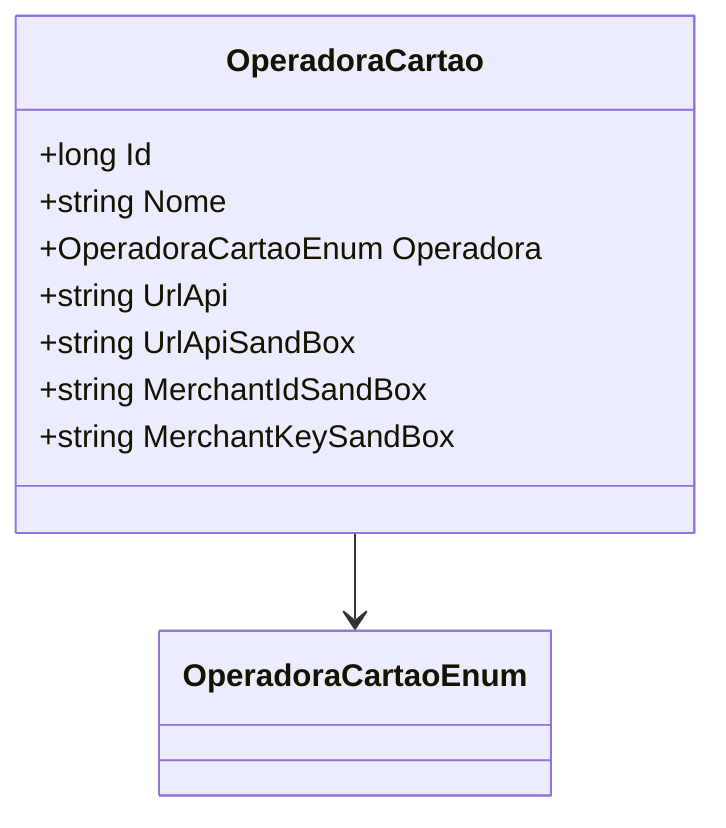

# OperadoraCartao
**Namespace**: IsthmusWinthor.Dominio.Entidades  
**Nome do Arquivo**: OperadoraCartao.cs  

## Visão Geral e Responsabilidade
A classe `OperadoraCartao` representa uma entidade que encapsula as informações e comportamentos relacionados a uma operadora de cartão no sistema. O objetivo principal dessa classe é centralizar e facilitar o gerenciamento dos dados necessários para a integração com diferentes operadoras, permitindo que o sistema manipule informações como URLs de API e credenciais de sandbox. Essa classe é essencial para garantir que a comunicação com operadoras de cartão seja feita de maneira consistente e segura.

## Métodos de Negócio
Não há métodos de negócio complexos definidos nesta classe, apenas propriedades básicas.

## Propriedades Calculadas e de Validação
Não há propriedades que contenham lógica em seu `get` ou validações em seus `set`.

## Navigations Property
Não existem propriedades que sejam classes complexas do domínio neste caso.

## Tipos Auxiliares e Dependências
- Enumeradores: [OperadoraCartaoEnum](OperadoraCartaoEnum.md)

## Diagrama de Relacionamentos

---
Gerada em 29/12/2025 20:40:24
