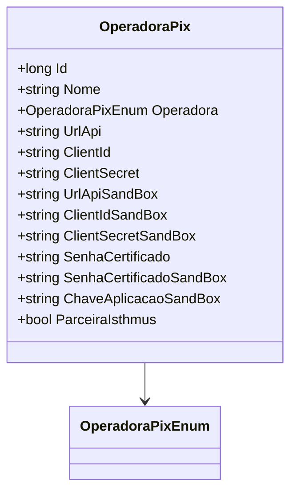

# OperadoraPix
**Namespace**: IsthmusWinthor.Dominio.Entidades  
**Nome do Arquivo**: OperadoraPix.cs

## Visão Geral e Responsabilidade
A classe `OperadoraPix` representa uma operadora de pagamentos via PIX dentro do sistema. Ela é responsável por armazenar informações essenciais relacionadas à integração com as APIs das operadoras, incluindo credenciais de autenticação e detalhes de configuração para ambientes de produção e sandbox. O problema de negócio que esta classe resolve é a centralização das informações necessárias para comunicação segura e eficaz com diferentes operadoras de pagamento, garantindo que a integração com APIs externas funcione de maneira uniforme.

## Métodos de Negócio
### Título: ParceiraIsthmus (Visibilidade: NotMapped)
- **Objetivo**: Determinar se a operadora PIX é uma parceira exclusivamente da Isthmus.
- **Comportamento**: O método verifica se a propriedade `Operadora` é igual a `OperadoraPixEnum.TBanks`. Se for verdade, o retorno é `true`, indicando que a operadora utiliza as credenciais da Isthmus para transações; caso contrário, retorna `false`, indicando que a operadora pode utilizar credenciais próprias.
- **Retorno**: Retorna um valor booleano que indica se a operação é realizada exclusivamente com credenciais da Isthmus.

## Propriedades Calculadas e de Validação
- **ParceiraIsthmus**: Esta propriedade computa a relação da operadora com a Isthmus, retornando `true` se a `Operadora` for `TBanks`. Essa validação é crucial para controlar o fluxo de autenticação e permitir um tratamento diferenciado de credenciais, garantindo que a segurança dos dados seja mantida.

## Navigation Property
- Nenhuma propriedade complexa de domínio é encontrada nesta classe.

## Tipos Auxiliares e Dependências
- **Enumeradores**:
  - `[OperadoraPixEnum](OperadoraPixEnum.md)`: Enum que define as operadoras PIX disponíveis.

## Diagrama de Relacionamentos

