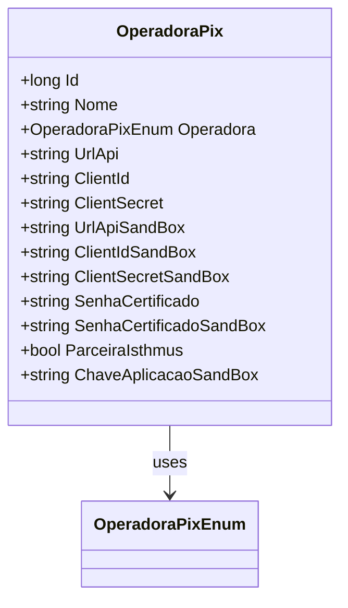

# OperadoraPix
**Namespace**: IsthmusWinthor.Dominio.Entidades  
**Nome do Arquivo**: OperadoraPix.cs  

## Visão Geral e Responsabilidade
A classe `OperadoraPix` representa uma entidade que encapsula as informações e credenciais necessárias para integração com operadoras de pagamento utilizando a tecnologia Pix. Seu papel é gerenciar os dados de configuração, como identificação dos clientes e senhas de certificados, necessários para interações com APIs de pagamento. Essa classe é crucial para garantir que a aplicação consiga realizar transações financeiras de forma segura e eficaz através de diferentes operadoras.

## Métodos de Negócio
### Título: ParceiraIsthmus (Propriedade)
- **Objetivo**: Determinar se a operadora é uma parceira exclusiva da Isthmus, o que implica que as credenciais utilizadas serão sempre as da Isthmus.
- **Comportamento**: 
  1. Avalia se a propriedade `Operadora` é igual a `OperadoraPixEnum.TBanks`.
  2. Retorna `true` se a condição for satisfeita, indicando que a operadora está trabalhando exclusivamente com a Isthmus; caso contrário, retorna `false`.
- **Retorno**: Um valor booleano que representa se a operadora é parceira da Isthmus.

## Propriedades Calculadas e de Validação
### ParceiraIsthmus
- **Regra**: A propriedade `ParceiraIsthmus` calcula se a operadora é TBanks, retornando `true` nesse caso e `false` em outras situações.

## Navigations Property
- Nenhuma propriedade complexa do domínio foi identificada nesta classe.

## Tipos Auxiliares e Dependências
- **Enumeradores**:
  - [OperadoraPixEnum](OperadoraPixEnum.md)

## Diagrama de Relacionamentos

---
Gerada em 29/12/2025 20:40:34
