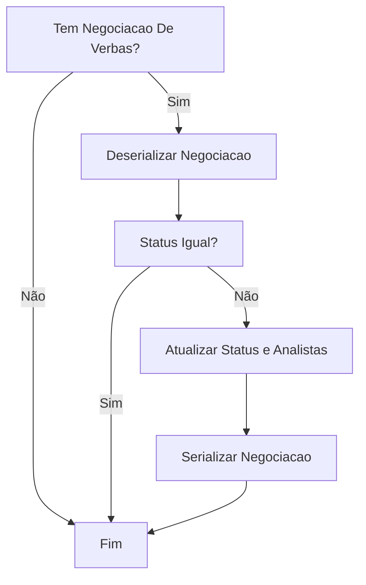
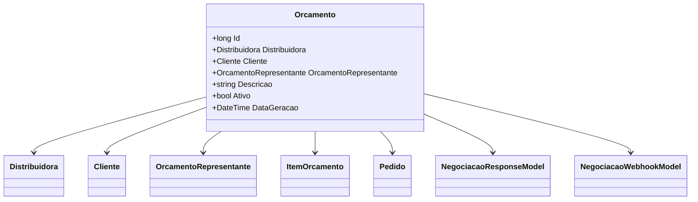

# Orcamento
**Namespace**: IsthmusWinthor.Dominio.Entidades  
**Nome do Arquivo**: Orcamento.cs  

## Visão Geral e Responsabilidade
A classe `Orcamento` representa um modelo de orçamento no sistema. Ela é responsável pela gestão de uma proposta comercial que pode incluir itens de venda, informações sobre o cliente, o representante comercial, e a negociação em termos de verbas aplicáveis. A classe resolve problemas de negócio relacionados ao controle de orçamentos, integração com verbas e a gestão de promoções, garantindo que os dados estejam sempre em conformidade com as regras de negócio definidas.

## Métodos de Negócio

### AtualizarStatusNegociacaoVerbas (public)
- **Objetivo**: Atualiza o status da negociação associada ao orçamento com base nas informações recebidas de um webhook.
- **Comportamento**:
  1. Verifica se a negociação de verbas está presente.
  2. Deserializa o JSON da negociação atual.
  3. Compara o status atual com o status recebido do modelo.
  4. Se o status não é igual, atualiza o status e cada analista associado com informações do modelo.
  5. Serializa novamente o objeto de negociação em JSON.
- **Retorno**: Retorna `true` se o status foi atualizado; caso contrário, retorna `false`.

### AtualizarPromocoesParaIntegracaoDaNegociacaoVerbas (public)
- **Objetivo**: Atualiza os itens de orçamento com promoções para integração da negociação de verbas.
- **Comportamento**:
  1. Verifica se a negociação de verbas está presente.
  2. Itera sobre a coleção de itens com promoção.
  3. Para cada item, localiza o item correspondente no orçamento e aplica a promoção.
  4. Verifica se todos os itens do orçamento são válidos para integração de verbas.
  5. Atualiza o JSON da negociação com as novas informações.
- **Retorno**: Nenhum retorno; se a validação falhar, lança uma exceção.

### CancelarNegociacaoVerbas (public)
- **Objetivo**: Cancela a negociação de verbas associada ao orçamento ao limpar o JSON.
- **Comportamento**: Define o JSON de negociação como uma string vazia.

### TotalOrcamento (public)
- **Objetivo**: Calcula o total do orçamento somando os preços dos itens.
- **Comportamento**:
  1. Itera sobre os itens do orçamento.
  2. Soma o total arredondado de cada item.
- **Retorno**: Retorna o valor total do orçamento.

### InformarIntegracao (public)
- **Objetivo**: Informa a negociação sobre a integração de pedidos.
- **Comportamento**:
  1. Verifica se a negociação de verbas está presente.
  2. Deserializa a negociação atual a partir do JSON.
  3. Confirma a integração utilizando a lista de números de pedidos.
  4. Serializa novamente o objeto de negociação em JSON.
  5. Informa sobre a tentativa de integração com sucesso.
- **Retorno**: Nenhum retorno.

### InformarTentativaIntegracaoPedido (public)
- **Objetivo**: Registra a tentativa de integração de pedidos.
- **Comportamento**:
  1. Verifica se a negociação de verbas está presente.
  2. Deserializa a negociação atual a partir do JSON.
  3. Adiciona a tentativa de integração com os dados fornecidos.
  4. Serializa novamente o objeto de negociação em JSON.
- **Retorno**: Nenhum retorno.

## Propriedades Calculadas e de Validação
### TemNegociacaoDeVerbas
- **Regra**: Verifica se o JSON da negociação não está vazio e se a negociação foi deserializada com sucesso.

### UsandoVerbas
- **Regra**: Retorna verdadeiro se a negociação de verbas está ativa e pelo menos um item do orçamento possui verba aplicada.

### AcrescimoAplicado
- **Regra**: Indica se algum item do orçamento teve acréscimos aplicados, considerando a negociação de verbas.

### DeveGerarDescontos
- **Regra**: Indica se há necessidade de gerar descontos com base nas verbas aplicadas.

### SomenteBonificacoes
- **Regra**: Verifica se todos os itens do orçamento estão aplicando apenas bonificações.

### ValidoParaIntegracaoVerbas
- **Regra**: Indica se a negociação pode ser integrada, validando o estado da negociação e dos itens.

### PlanosPagamentoCarrinho
- **Regra**: Interpreta um JSON que lista os planos de pagamento, garantindo a correta serialização e deserialização.

### Negociacao
- **Regra**: Propriedade que manipula o JSON da negociação, permitindo acessos diretos ao modelo de resposta deserializado.

## Navigations Property
- [Distribuidora](Distribuidora.md)
- [Cliente](Cliente.md)
- [OrcamentoRepresentante](OrcamentoRepresentante.md)
- [ItemOrcamento](ItemOrcamento.md)
- [Pedido](Pedido.md)

## Tipos Auxiliares e Dependências
- [NegociacaoResponseModel](NegociacaoResponseModel.md)
- [NegociacaoWebhookModel](NegociacaoWebhookModel.md)
- [NegociacaoAnalistaWebhookModel](NegociacaoAnalistaWebhookModel.md)
- [DescontoOrcamentoVerba](DescontoOrcamentoVerba.md)
- [NegociacaoIntegracaoPedidoTentativaResponseModel](NegociacaoIntegracaoPedidoTentativaResponseModel.md)

## Diagrama de Relacionamentos

---
Gerada em 29/12/2025 20:41:04
