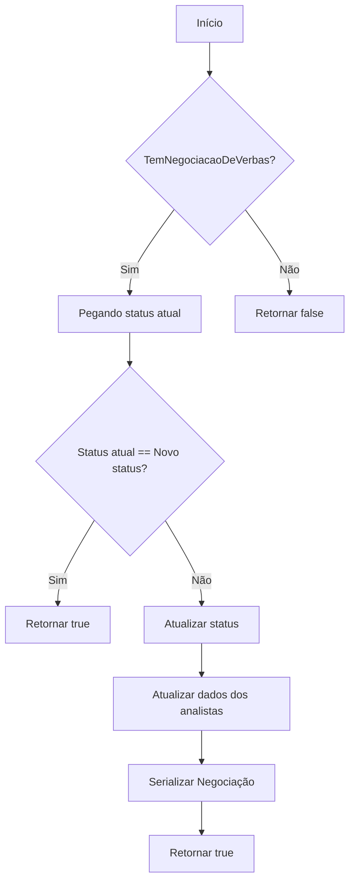
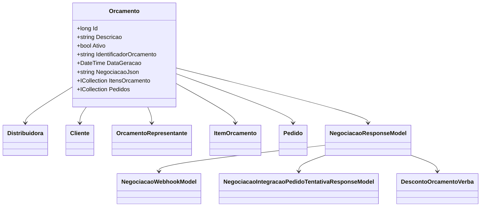

# Orcamento
**Namespace**: IsthmusWinthor.Dominio.Entidades  
**Nome do Arquivo**: Orcamento.cs  

## Visão Geral e Responsabilidade
A classe `Orcamento` atua como uma raiz de agregado no sistema, representando uma proposta comercial que pode conter múltiplos itens e está associada a uma distribuidora e um cliente. Ela é responsável por gerenciar a negociação de verbas relacionadas ao orçamento, garantindo que as regras de negócio associadas ao processamento de itens sejam respeitadas e gerenciando a integração com sistemas externos.

## Métodos de Negócio

### AtualizarStatusNegociacaoVerbas (public)
- **Objetivo**: Atualizar o status da negociação associada ao orçamento com base em um modelo fornecido.
- **Comportamento**:
  1. Verifica se há uma negociação de verbas associada ao orçamento.
  2. Se o status atual da negociação já for o mesmo do modelo, retorna `true`.
  3. Atualiza o status da negociação para o status recebido no modelo.
  4. Para cada analista na negociação, atualiza os dados com informações do modelo.
  5. Serializa a negociação atualizada de volta para o formato JSON.
- **Retorno**: Retorna `true` se o status foi atualizado, caso contrário, retorna `false`.

### AtualizarPromocoesParaIntegracaoDaNegociacaoVerbas (public)
- **Objetivo**: Atualizar os itens do orçamento com as promoções relacionadas à negociação de verbas para garantir que os dados estejam prontos para integração.
- **Comportamento**:
  1. Verifica se há uma negociação de verbas.
  2. Para cada item de promoção recebido, encontra o item no orçamento correspondente e atualiza sua promoção.
  3. Verifica se todos os itens são válidos para integração.
  4. Atualiza os dados da negociação com as promoções.
- **Retorno**: Não possui retorno, mas lança uma exceção se houver itens inválidos para integração.

### TotalOrcamento (public)
- **Objetivo**: Calcular o total do orçamento somando os preços totais de todos os itens incluídos.
- **Comportamento**:
  1. Itera sobre a coleção de itens do orçamento.
  2. Para cada item, chama o método `PrecoTotal()`, arredondando o valor.
  3. Soma os valores arredondados para retornar o total do orçamento.
- **Retorno**: Retorna um `decimal` que representa o total do orçamento.

## Propriedades Calculadas e de Validação

### TemNegociacaoDeVerbas
- **Regra**: Indica se o orçamento possui uma negociação de verbas válida. É calculado verificando se o JSON da negociação não está vazio e se a negociação foi corretamente desserializada.

### ValidoParaIntegracaoVerbas
- **Regra**: Indica se o orçamento pode ser integrado levando em consideração a validade da negociação e a validade de todos os itens para integração.

## Navigations Property
- [`Distribuidora`](Distribuidora.md)
- [`Cliente`](Cliente.md)
- [`OrcamentoRepresentante`](OrcamentoRepresentante.md)
- [`ItensOrcamento`](ItemOrcamento.md)
- [`Pedidos`](Pedido.md)

## Tipos Auxiliares e Dependências
- [`NegociacaoResponseModel`](NegociacaoResponseModel.md)
- [`NegociacaoWebhookModel`](NegociacaoWebhookModel.md)
- [`NegociacaoIntegracaoPedidoTentativaResponseModel`](NegociacaoIntegracaoPedidoTentativaResponseModel.md)
- [`DescontoOrcamentoVerba`](DescontoOrcamentoVerba.md)

## Diagrama de Relacionamentos

