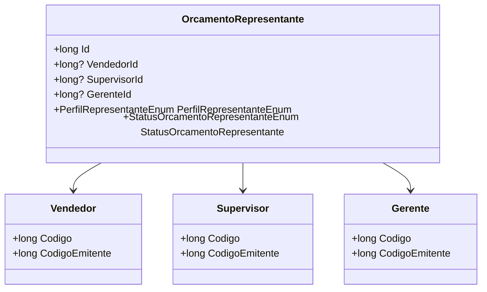

# OrcamentoRepresentante
**Namespace**: IsthmusWinthor.Dominio.Entidades  
**Nome do Arquivo**: OrcamentoRepresentante.cs  

## Visão Geral e Responsabilidade
A classe `OrcamentoRepresentante` representa um agente responsável por orçamentos, que pode ser um Vendedor, Supervisor ou Gerente. Sua principal função é consolidar informações e estados relacionados ao representante de forma a suportar o processamento e gerenciamento de orçamentos em um sistema corporativo. O problema de negócio que resolve é a necessidade de manter uma referência e controle de quem está gerenciando cada orçamento, permitindo a verificação e atribuição correta de responsabilidades.

## Métodos de Negócio
### Título: RepresentanteId (NotMapped)
- **Objetivo**: Garante que, ao buscar o ID do representante, ele retorne o ID do primeiro agente disponível (Vendedor, Supervisor ou Gerente).
- **Comportamento**: 
  1. Verifica se `VendedorId` possui um valor; se sim, retorna esse valor.
  2. Caso contrário, verifica `SupervisorId` e retorna o seu valor se disponível.
  3. Se também não houver um Supervisor, busca o valor de `GerenteId`.
  4. Se nenhuma das opções estiver disponível, retorna 0.
- **Retorno**: O ID do representante associado ao orçamento ou 0 se nenhum representante estiver presente.

### Título: CodigoRepresentante (NotMapped)
- **Objetivo**: Fornece o código do representante associado ao orçamento.
- **Comportamento**: 
  1. Primeiro, verifica se o `Vendedor` está presente; se sim, retorna o `Codigo` desse `Vendedor`.
  2. Se o `Vendedor` não estiver definido, verifica se existe um `Supervisor` e retorna seu `Codigo`.
  3. Se não houver um `Supervisor`, verifica o `Gerente` e retorna seu `Codigo`.
  4. Se nenhum representante estiver presente, retorna 0.
- **Retorno**: O código do representante apropriado ou 0 se nenhum representante estiver associado.

### Título: CodigoEmitente (NotMapped)
- **Objetivo**: Retorna o código do emitente baseado no representante (Vendedor, Supervisor ou Gerente).
- **Comportamento**: 
  1. Verifica se o `Vendedor` está setado; se afirmativo, retorna o `CodigoEmitente` do `Vendedor`.
  2. Se não houver `Vendedor`, verifica o `Supervisor` e retorna seu `CodigoEmitente`.
  3. Se o `Supervisor` não estiver definido, busca o `Gerente` e retorna seu `CodigoEmitente`.
  4. Retorna 0 se nenhum dos representantes estiver associado.
- **Retorno**: O código do emitente do representante apropriado ou 0 se não estiver definido.

## Propriedades Calculadas e de Validação
- `RepresentanteId`: Calculado a partir do Vendedor, Supervisor e Gerente, garantindo que sempre retorne um ID válido se um deles estiver definido.
- `CodigoRepresentante`: Calculado com base na presença dos representantes, assegurando que retorne o código do primeiro agente disponível.
- `CodigoEmitente`: Semelhante aos anteriores, garante que retorne o código do emitente correto baseado no agente associado.

## Navigations Property
- [Vendedor](Vendedor.md)
- [Supervisor](Supervisor.md)
- [Gerente](Gerente.md)

## Tipos Auxiliares e Dependências
- [PerfilRepresentanteEnum](PerfilRepresentanteEnum.md)
- [StatusOrcamentoRepresentanteEnum](StatusOrcamentoRepresentanteEnum.md)

## Diagrama de Relacionamentos

Esta documentação reflete as regras de negócio e estrutura da classe `OrcamentoRepresentante`, facilitando a compreensão e a manutenção do sistema.
---
Gerada em 29/12/2025 20:41:22
