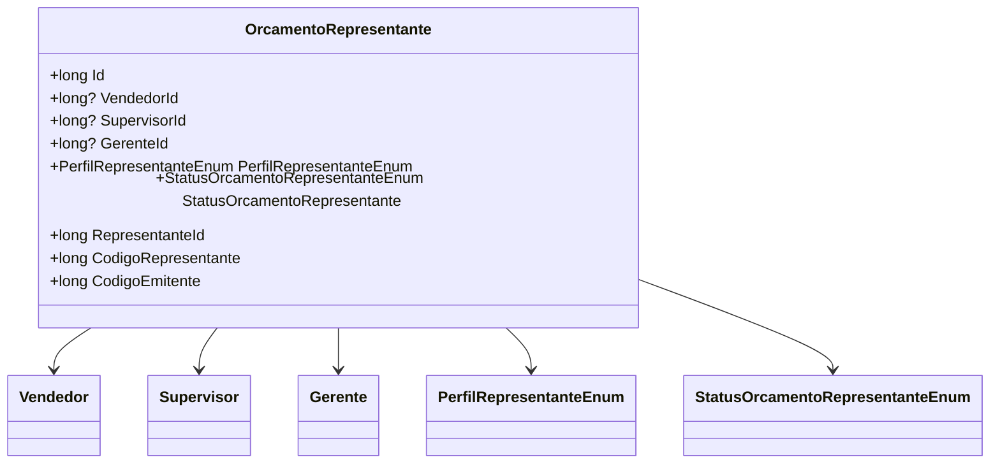

# OrcamentoRepresentante

**Namespace**: IsthmusWinthor.Dominio.Entidades  
**Nome do Arquivo**: OrcamentoRepresentante.cs  

## Visão Geral e Responsabilidade
A classe `OrcamentoRepresentante` representa a conexão entre orçamentos e seus respectivos representantes na organização, sendo eles Vendedores, Supervisores e Gerentes. Este modelo de domínio é crucial para a gestão de orçamentos, pois permite identificar e associar um orçamento a um representante específico, seguindo sua hierarquia. Ele é responsável por garantir que a identificação e os códigos relacionados ao representante sejam corretamente atribuídos, facilitando o controle e a geração de relatórios.

## Métodos de Negócio
### Título: RepresentanteId (public long RepresentanteId)
- **Objetivo**: Garante que, ao acessar o identificador do representante, seja retornada a identificação correta de acordo com a hierarquia de representantes (Vendedor, Supervisor ou Gerente).
- **Comportamento**: 
  1. Verifica se `VendedorId` tem valor; se sim, retorna `VendedorId`.
  2. Se não, verifica se `SupervisorId` tem valor; se sim, retorna `SupervisorId`.
  3. Se não, verifica se `GerenteId` tem valor; se sim, retorna `GerenteId`.
  4. Se nenhum identificador for encontrado, retorna `0`.
- **Retorno**: Um valor `long` que representa o ID do representante. Se nenhum representante for encontrado, retorna `0`.

### Título: CodigoRepresentante (public long CodigoRepresentante)
- **Objetivo**: Garante que o código do representante referente ao orçamento seja corretamente recuperado, priorizando a hierarquia de representantes.
- **Comportamento**:
  1. Verifica se `Vendedor` não é nulo; se não for, retorna `Vendedor.Codigo`.
  2. Se `Vendedor` for nulo, verifica se `Supervisor` não é nulo; se não for, retorna `Supervisor.Codigo`.
  3. Se ambos forem nulos, verifica se `Gerente` não é nulo; se não for, retorna `Gerente.Codigo`.
  4. Se nenhum representante for encontrado, retorna `0`.
- **Retorno**: Um valor `long` que representa o código do representante associado. Retorna `0` caso nenhum representante seja encontrado.

### Título: CodigoEmitente (public long CodigoEmitente)
- **Objetivo**: Garante a obtenção do código de emitente do orçamento, priorizando a hierarquia de representantes.
- **Comportamento**:
  1. Verifica se `Vendedor` não é nulo; se não for, retorna `Vendedor.CodigoEmitente`.
  2. Se `Vendedor` for nulo, verifica se `Supervisor` não é nulo; se não for, retorna `Supervisor.CodigoEmitente`.
  3. Se ambos forem nulos, verifica se `Gerente` não é nulo; se não for, retorna `Gerente.CodigoEmitente`.
  4. Se nenhum representante for encontrado, retorna `0`.
- **Retorno**: Um valor `long` que representa o código de emitente associado. Retorna `0` caso nenhum representante seja encontrado.

## Propriedades Calculadas e de Validação
- **RepresentanteId**: Esta propriedade calcula o ID do representante, priorizando Vendedor, Supervisor e Gerente, garantindo que um orçamento sempre esteja associado a um representante válido.
- **CodigoRepresentante**: Calcula o código associado ao representante da mesma maneira, retornando `0` caso não existam representantes válidos.
- **CodigoEmitente**: Similarmente, esta propriedade busca recuperar o código de emitente seguindo a mesma lógica hierárquica.

## Navigation Properties
- `[Vendedor](Vendedor.md)`
- `[Supervisor](Supervisor.md)`
- `[Gerente](Gerente.md)`

## Tipos Auxiliares e Dependências
- `[PerfilRepresentanteEnum](PerfilRepresentanteEnum.md)`
- `[StatusOrcamentoRepresentanteEnum](StatusOrcamentoRepresentanteEnum.md)`

## Diagrama de Relacionamentos

