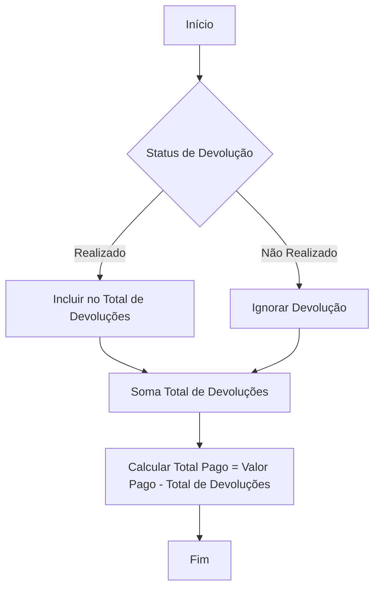
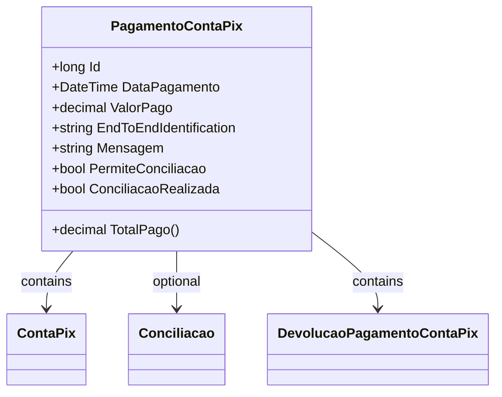

# PagamentoContaPix
- **Namespace**: IsthmusWinthor.Dominio.Entidades
- **Nome do Arquivo**: PagamentoContaPix.cs

## Visão Geral e Responsabilidade
A classe `PagamentoContaPix` representa a entidade de pagamento realizado através do sistema de pagamentos via QR Code (Conta Pix). Ela é responsável por gerenciar as informações dos pagamentos, incluindo o valor pago e a possibilidade de conciliação de contas. Um dos principais problemas de negócio que esta classe aborda é a necessidade de controle de devoluções associadas aos pagamentos, permitindo um cálculo preciso do valor total recebido pelo sistema, considerando as devoluções que não foram realizadas.

## Métodos de Negócio

### Método: `TotalPago` (public)
- **Objetivo:** Calcular o total de um pagamento, subtraindo qualquer valor de devolução que não tenha sido realizada.
- **Comportamento:**
  1. Recupera a lista de devoluções associadas ao pagamento.
  2. Filtra as devoluções para incluir apenas aquelas cujo status não é "Não Realizado".
  3. Soma os valores de devolução dessas devoluções filtradas.
  4. Retorna o resultado do valor pago menos o total de devoluções.
- **Retorno:** Retorna um valor decimal representando o total considerado do pagamento, que é o valor pago subtraído das devoluções válidas.

## Propriedades Calculadas e de Validação

### Propriedade: `ConciliacaoRealizada` (NotMapped)
- **Regra:** A propriedade indica se a conciliação foi realizada, que ocorre quando a flag `PermiteConciliacao` é verdadeira e a propriedade `Conciliacao` possui um número de conciliação válido (maior que zero).

## Navigations Property
- `ContaPix`: `[ContaPix](ContaPix.md)`
- `Conciliacao`: `[Conciliacao](Conciliacao.md)`
- `DevolucaoPagamentoContaPix`: `[DevolucaoPagamentoContaPix](DevolucaoPagamentoContaPix.md)`

## Tipos Auxiliares e Dependências
- `StatusDevolucaoPixEnum`: `[StatusDevolucaoPixEnum](StatusDevolucaoPixEnum.md)`

## Diagrama de Relacionamentos

