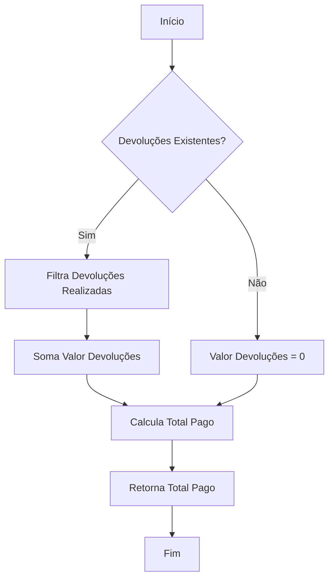
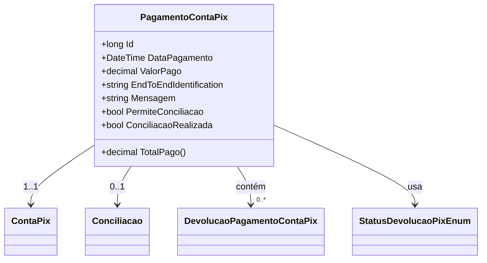

# PagamentoContaPix
- **Namespace**: IsthmusWinthor.Dominio.Entidades
- **Nome do Arquivo**: PagamentoContaPix.cs

## Visão Geral e Responsabilidade
A classe `PagamentoContaPix` representa uma entidade de domínio responsável por gerenciar os pagamentos realizados via sistema de pagamento Pix. Esta classe é vital para garantir que todos os registros de pagamentos sejam corretamente geridos e permita também o controle sobre devoluções e conciliações de pagamentos. O problema de negócio que ela resolve é a necessidade de uma representação robusta e clara das operações financeiras realizadas através do Pix, assegurando que os dados estão íntegros e corretamente conciliados.

## Métodos de Negócio

### TotalPago() - Public
- **Objetivo**: Garante que o total pago pelo cliente seja calculado corretamente, levando em consideração as devoluções.
- **Comportamento**:
    1. Verifica se existe alguma devolução associada ao pagamento e filtra as devoluções que já foram realizadas.
    2. Soma o valor total das devoluções que foram efetivadas.
    3. Subtrai o total das devoluções do valor pago, retornando o saldo final efetivamente pago.
- **Retorno**: Retorna um valor do tipo `decimal` que representa o total efetivamente pago após considerar devoluções.

## Propriedades Calculadas e de Validação

### ConciliacaoRealizada
- **Regra**: A propriedade `ConciliacaoRealizada` é avaliada para indicar se a conciliação foi realizada. Ela retorna verdadeiro se a propriedade `PermiteConciliacao` estiver marcada como verdadeira e se a propriedade `Conciliacao` existir com um número de conciliação maior que 0.

## Navigations Property
- [ContaPix](ContaPix.md)
- [Conciliacao](Conciliacao.md)
- [DevolucaoPagamentoContaPix](DevolucaoPagamentoContaPix.md)

## Tipos Auxiliares e Dependências
- [StatusDevolucaoPixEnum](StatusDevolucaoPixEnum.md)

## Diagrama de Relacionamentos

---
Gerada em 29/12/2025 20:41:36
