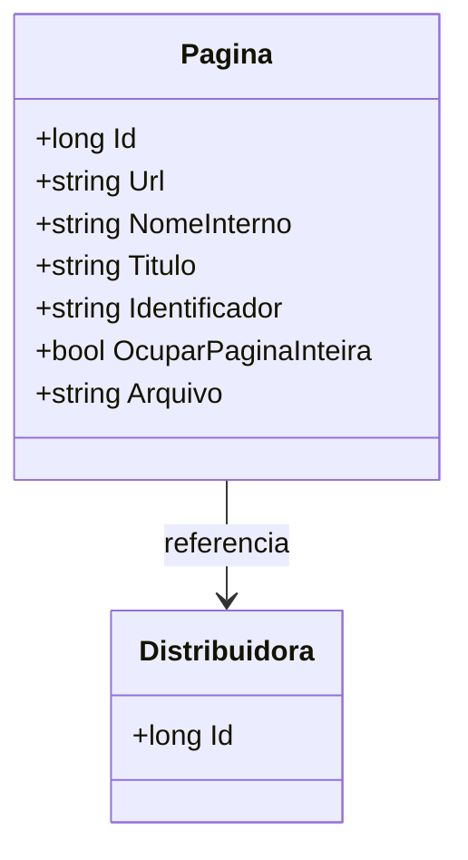

# Pagina
**Namespace**: IsthmusWinthor.Dominio.Entidades  
**Nome do Arquivo**: Pagina.cs  

## Visão Geral e Responsabilidade
A classe `Pagina` representa uma entidade do domínio que encapsula os dados e comportamentos relacionados a uma página vinculada a uma distribuidora. O principal problema de negócio que ela resolve é a organização e o armazenamento eficiente das informações de páginas, além de facilitar a geração dinâmica do arquivo HTML associado a cada página. A classe assegura que cada página tenha uma URL única e um título apropriado, garantindo assim a integridade dos dados associados.

## Métodos de Negócio

### Título: `Arquivo` (ReadOnly)
- **Objetivo**: Garante a construção de um nome de arquivo único para cada página baseada no ID da distribuidora e no identificador da página.
- **Comportamento**: 
  1. Ao acessar a propriedade `Arquivo`, o sistema gera uma string formatada que inclui o prefixo "pagina-html-livre-", seguido pelo ID da distribuidora e pelo identificador da página.
  2. O valor resultante é retornado como o nome do arquivo destinado a representar a página em formato HTML.
- **Retorno**: Astring gerada que representa o nome do arquivo HTML da página.

## Propriedades Calculadas e de Validação
- **Arquivo**: O valor do arquivo é computado a partir dos atributos `DistribuidoraId` e `Identificador`. Essa propriedade assegura que o nome do arquivo esteja estruturado corretamente para cada página baseada nas informações da distribuidora.

## Navigations Property
- **Distribuidora**: `[Distribuidora](Distribuidora.md)`

## Tipos Auxiliares e Dependências
- Nenhum enumerador ou classe estática foi utilizado nesta classe.

## Diagrama de Relacionamentos

