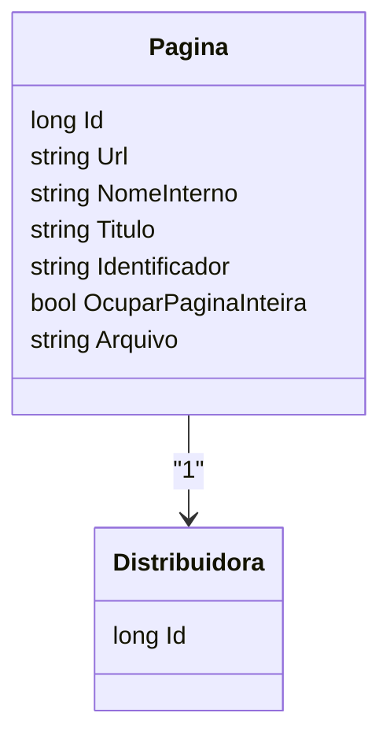

# Pagina
**Namespace**: IsthmusWinthor.Dominio.Entidades  
**Nome do Arquivo**: Pagina.cs  

## Visão Geral e Responsabilidade
A classe `Pagina` representa uma entidade do domínio que lida com as informações de uma página dentro do contexto de uma distribuidora. Sua principal responsabilidade é armazenar e gerenciar dados relevantes da página, como a URL, nome interno, título e um identificador gerado pelo banco de dados. O problema de negócio que ela resolve é a necessidade de vincular páginas a distribuidoras específicas, permitindo a criação e gestão de conteúdo direcionado.

## Propriedades Calculadas e de Validação
- **Arquivo**: Esta propriedade computa o nome do arquivo HTML correspondente à página, utilizando o `DistribuidoraId` e o `Identificador`. Essa lógica é crucial para garantir que o nome do arquivo gerado é único e segue um padrão específico, que é necessário para o correto armazenamento e acesso ao conteúdo.

## Navigations Property
- **Distribuidora**: [Distribuidora](Distribuidora.md) - Representa a relação de associação entre a entidade `Pagina` e a entidade `Distribuidora`. Cada página está associada a uma única distribuidora.

## Tipos Auxiliares e Dependências
- Não há enumeradores ou classes estáticas/helpers adicionais utilizadas na classe `Pagina`.

## Diagrama de Relacionamentos

---
Gerada em 29/12/2025 20:41:43
