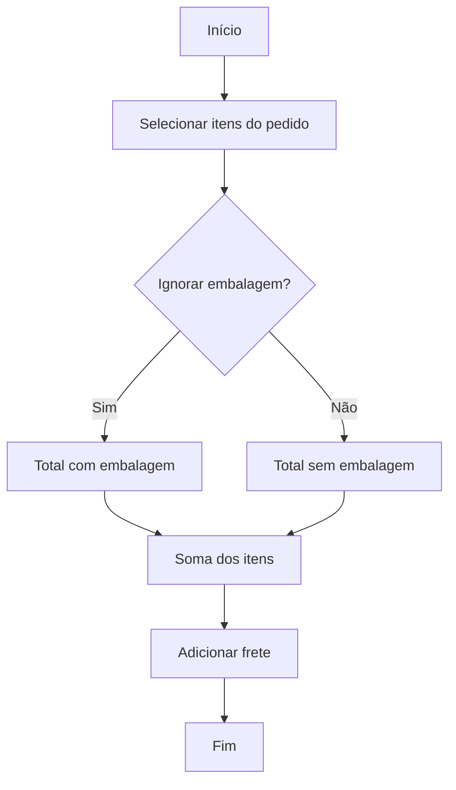
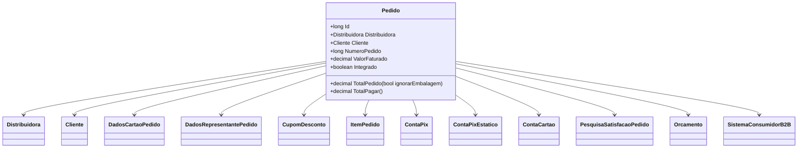

# Pedido
**Namespace**: IsthmusWinthor.Dominio.Entidades  
**Nome do Arquivo**: Pedido.cs  

## Visão Geral e Responsabilidade
A classe `Pedido` representa um pedido de um cliente em um sistema de e-commerce, abordando as necessidades de controle e integração de pedidos. Essa classe encapsula a lógica empresarial relacionada ao processamento de pedidos, incluindo a definição de condições de venda, cálculos totais do pedido e a gestão de alternativas de pagamento.

## Métodos de Negócio

### TotalPedido
- **Título**: `TotalPedido` (public)
- **Objetivo**: Este método calcula o valor total do pedido, considerando o preço de todos os itens de pedido e o custo de frete.
- **Comportamento**:
  1. Seleciona todos os itens do pedido.
  2. Para cada item, obtém o preço total de venda (possivelmente permitindo ignorar custos de embalagem).
  3. Soma os preços de todos os itens.
  4. Adiciona o valor do frete ao total calculado.
- **Retorno**: O valor total do pedido como um `decimal`, representando o custo agregando todos os preços dos itens e o frete.

### TotalPagar
- **Título**: `TotalPagar` (public)
- **Objetivo**: Este método calcula o total que cabe ao cliente pagar, descontando valores relacionados a cashback e cupons de desconto.
- **Comportamento**:
  1. Chama o método `TotalPedido` para obter o valor total do pedido.
  2. Subtrai o total de cashback acumulado (calculado pelo método `TotalCashBack`).
  3. Subtrai o total de cupons de desconto (calculado pelo método `TotalCupomDesconto`).
- **Retorno**: O valor final a ser pago pelo cliente como um `decimal`.

### TotalCashBack
- **Título**: `TotalCashBack` (public)
- **Objetivo**: Calcula o total de cashback acumulado pelos itens do pedido.
- **Comportamento**:
  1. Seleciona todos os itens do pedido.
  2. Soma o valor de desconto do cashback referente a cada item.
- **Retorno**: O total de cashback como `decimal`.

### TotalCupomDesconto
- **Título**: `TotalCupomDesconto` (public)
- **Objetivo**: Calcula o total de descontos aplicados via cupom no pedido.
- **Comportamento**:
  1. Seleciona todos os itens do pedido.
  2. Soma o valor de desconto por cupom para cada item.
- **Retorno**: O total dos descontos de cupons como `decimal`.

## Propriedades Calculadas e de Validação
### Propriedades
- `Pharmalink`: Este booleano indica se algum item do pedido utiliza o método de pagamento Pharmalink.
- `IsthmusIndustria`: Booleano que indica se o pedido é industrial, baseada no campo de estado do cliente em relação à distribuidora.
- `Interestadual`: Booleano que indica se a entrega do pedido é interestadual, avaliando se o estado do cliente é o mesmo que o da distribuidora.
- `PagamentoAVista`: Indica se o pagamento do pedido é feito à vista, baseado nas opções de pagamento disponíveis.

## Navigations Property
- `Distribuidora`: [Distribuidora](Distribuidora.md)
- `Cliente`: [Cliente](Cliente.md)
- `DadosCartaoPedido`: [DadosCartaoPedido](DadosCartaoPedido.md)
- `DadosRepresentantePedido`: [DadosRepresentantePedido](DadosRepresentantePedido.md)
- `CupomDesconto`: [CupomDesconto](CupomDesconto.md)
- `ItensPedido`: [ItemPedido](ItemPedido.md)
- `ContaPix`: [ContaPix](ContaPix.md)
- `ContaPixEstatico`: [ContaPixEstatico](ContaPixEstatico.md)
- `ContaCartao`: [ContaCartao](ContaCartao.md)
- `PesquisaSatisfacaoPedido`: [PesquisaSatisfacaoPedido](PesquisaSatisfacaoPedido.md)
- `Orcamento`: [Orcamento](Orcamento.md)
- `SistemaConsumidorB2B`: [SistemaConsumidorB2B](SistemaConsumidorB2B.md)

## Tipos Auxiliares e Dependências
- `OpcaoPagamento`: [OpcaoPagamento](OpcaoPagamento.md)
- `StatusPedidoEnum`: [StatusPedidoEnum](StatusPedidoEnum.md)
- `CondicaoVendaEnum`: [CondicaoVendaEnum](CondicaoVendaEnum.md)
- `TipoSolucao`: [TipoSolucao](TipoSolucao.md)

## Diagrama de Relacionamentos

---
Gerada em 29/12/2025 20:42:12
