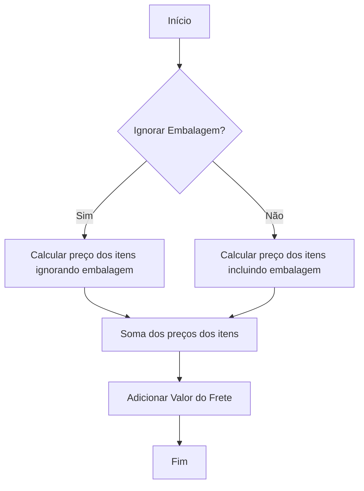
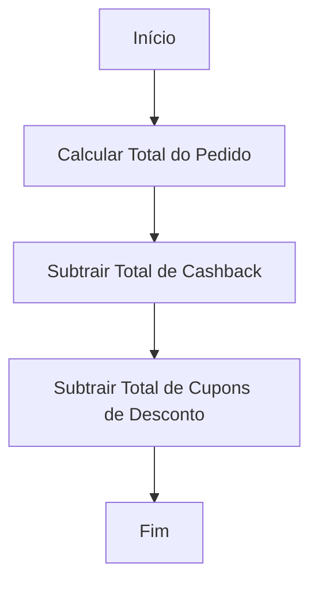
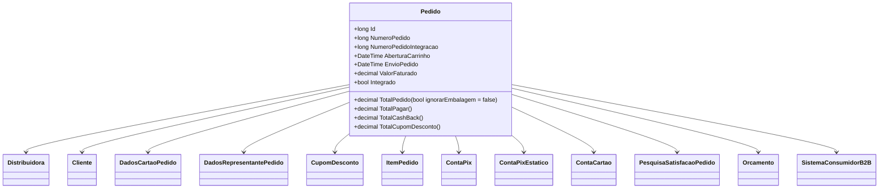

# Pedido
**Namespace**: IsthmusWinthor.Dominio.Entidades  
**Nome do Arquivo**: Pedido.cs  

## Visão Geral e Responsabilidade
A classe `Pedido` representa um pedido realizado por um cliente em um sistema de vendas, integrando informações de clientes, distribuidores e itens do pedido. Ela gerencia a lógica relacionada ao estado do pedido e às operações de cálculo de valores totais, além de garantir a integridade das informações durante o fluxo de integração com sistemas externos, como ERPs. O problema de negócio que esta classe resolve é o gerenciamento eficiente e organizado dos pedidos, garantindo a precisão nos cálculos e controle do estado do pedido.

## Métodos de Negócio

### `TotalPedido(bool ignorarEmbalagem = false)`
- **Objetivo**: Calcula o valor total do pedido, levando em consideração todos os itens e o valor do frete.
- **Comportamento**: 
  1. Utiliza a coleção `ItensPedido` para iterar sobre cada item do pedido.
  2. Para cada item, chama o método `PrecoVendaTotal`, que calcula o preço de venda total do item (possivelmente ignorando a embalagem, caso especificado).
  3. Soma todos os preços dos itens e adiciona o valor do frete ao resultado.
  4. Retorna o total arredondado para duas casas decimais.
- **Retorno**: O valor total do pedido, somando os preços dos itens e o frete.

### `TotalPagar()`
- **Objetivo**: Calcula o valor que o cliente deve pagar, subtraindo o cashback e o valor do cupom de desconto do total do pedido.
- **Comportamento**:
  1. Chama o método `TotalPedido()` para obter o valor total inicial.
  2. Subtrai o retorno do método `TotalCashBack()` que calcula o total de cashback aplicado.
  3. Subtrai o retorno do método `TotalCupomDesconto()` que calcula o total de descontos aplicados via cupons.
  4. Retorna o valor final que o cliente deve pagar.
- **Retorno**: O total a ser pago pelo cliente, após considerar descontos.

### `TotalCashBack()`
- **Objetivo**: Calcula o total de cashback aplicado no pedido.
- **Comportamento**:
  1. Itera sobre cada item do `ItensPedido`.
  2. Soma todos os valores de desconto de cashback dos itens.
  3. Retorna o total arredondado.
- **Retorno**: O valor total de cashback aplicado.

### `TotalCupomDesconto()`
- **Objetivo**: Calcula o total de descontos aplicados por cupons no pedido.
- **Comportamento**:
  1. Itera sobre cada item do `ItensPedido`.
  2. Soma todos os valores dos descontos dos cupons de cada item.
  3. Retorna o total arredondado.
- **Retorno**: O valor total de descontos por cupons.

## Propriedades Calculadas e de Validação
- **`PedidoGeradoPorOrcamentoRepresentante`**: 
  - Regra: Indica se o pedido foi gerado a partir de um orçamento feito por um representante, verificando a propriedade `DadosRepresentantePedido`.

- **`Pharmalink`**:
  - Regra: Retorna verdadeiro se algum item do pedido for do tipo Pharmalink.

- **`IsthmusIndustria`**:
  - Regra: Retorna verdadeiro se todos os itens do pedido são da categoria IsthmusIndústria.

- **`Interestadual`**:
  - Regra: Verifica se a UF do cliente é a mesma da distribuidora.

- **`PagamentoAVista`**:
  - Regra: Retorna verdadeiro se a opção de pagamento for Pix ou Dinheiro.

## Navigations Property
- `[Distribuidora](Distribuidora.md)`
- `[Cliente](Cliente.md)`
- `[DadosCartaoPedido](DadosCartaoPedido.md)`
- `[DadosRepresentantePedido](DadosRepresentantePedido.md)`
- `[CupomDesconto](CupomDesconto.md)`
- `[ItemPedido](ItemPedido.md)`
- `[ContaPix](ContaPix.md)`
- `[ContaPixEstatico](ContaPixEstatico.md)`
- `[ContaCartao](ContaCartao.md)`
- `[PesquisaSatisfacaoPedido](PesquisaSatisfacaoPedido.md)`
- `[Orcamento](Orcamento.md)`
- `[SistemaConsumidorB2B](SistemaConsumidorB2B.md)`

## Tipos Auxiliares e Dependências
- Enumeradores:
  - `[OpcaoPagamento](OpcaoPagamento.md)`
  - `[StatusPedidoEnum](StatusPedidoEnum.md)`
  - `[CondicaoVendaEnum](CondicaoVendaEnum.md)`
  - `[TipoSolucao](TipoSolucao.md)`

## Diagrama de Relacionamentos

