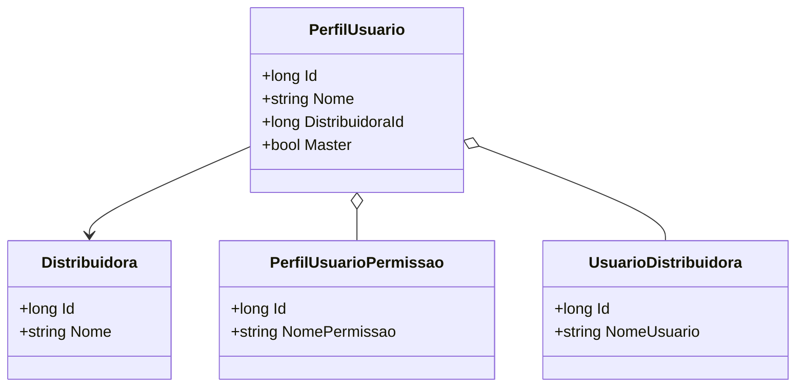

# PerfilUsuario
**Namespace**: IsthmusWinthor.Dominio.Entidades  
**Nome do Arquivo**: PerfilUsuario.cs  

## Visão Geral e Responsabilidade
A classe `PerfilUsuario` representa um perfil de usuário dentro do sistema, permitindo a associação de usuários a distribuidoras e a aplicação de permissões específicas a cada perfil. Sua principal responsabilidade é garantir que um usuário tenha o conjunto apropriado de permissões e associações de distribuição, assegurando que as operações realizadas estejam de acordo com os direitos e límites estabelecidos.

## Métodos de Negócio
A classe `PerfilUsuario` não contém métodos de negócio complexos, pois suas operações estão inteiramente relacionadas à manipulação de dados de entidades associadas. Portanto, não há detalhamentos para métodos com lógica.

## Propriedades Calculadas e de Validação
- **Nome**: A propriedade `Nome` deve ser válida e única entre os perfis de usuário, assegurando que não existem dois perfis com o mesmo nome para um mesmo contexto de distribuição. A validação deve garantir que o valor não esteja vazio e que atenda a uma regra de comprimento mínimo e máximo, se necessário.

## Navigation Property
- [Distribuidora](Distribuidora.md): Representa a distribuidora à qual o perfil de usuário está associado.
- [PerfilUsuarioPermissao](PerfilUsuarioPermissao.md): Coleção que determina as permissões específicas atribuídas ao perfil do usuário.
- [UsuarioDistribuidora](UsuarioDistribuidora.md): Coleção que relaciona usuários à distribuidora, permitindo a gestão de usuários dentro da distribuidora associada.

## Tipos Auxiliares e Dependências
- Nenhum tipo auxiliar ou enumerador específico foi identificado nesta classe.

## Diagrama de Relacionamentos

---
Gerada em 29/12/2025 20:42:22
