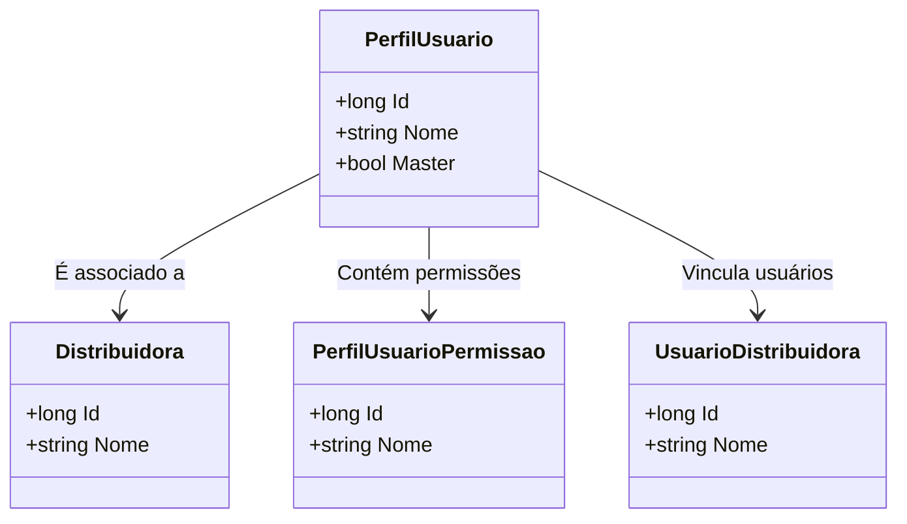

# PerfilUsuario
**Namespace**: IsthmusWinthor.Dominio.Entidades  
**Nome do Arquivo**: PerfilUsuario.cs  

## Visão Geral e Responsabilidade
A classe `PerfilUsuario` representa um modelo de domínio que define um perfil de usuário no sistema. Esse perfil gerencia as permissões associadas aos usuários e sua vinculação a uma distribuidora específica. O problema de negócio que esta classe resolve é a necessidade de organzação e controle de acesso de usuários dentro do sistema, permitindo a atribuição de diferentes permissões e funcionalidades conforme o perfil que cada usuário possui.

## Métodos de Negócio
Não há métodos de negócio complexos definidos nesta classe, apenas propriedades para definir o estado do objeto.

## Propriedades Calculadas e de Validação
Não há propriedades com lógica no `get` ou validação no `set` nesta classe.

## Navigations Property
- [Distribuidora](Distribuidora.md)
- [PerfilUsuarioPermissao](PerfilUsuarioPermissao.md)
- [UsuarioDistribuidora](UsuarioDistribuidora.md)

## Tipos Auxiliares e Dependências
Nenhum enumerador ou classe estática/helper é utilizada diretamente nesta classe.

## Diagrama de Relacionamentos

