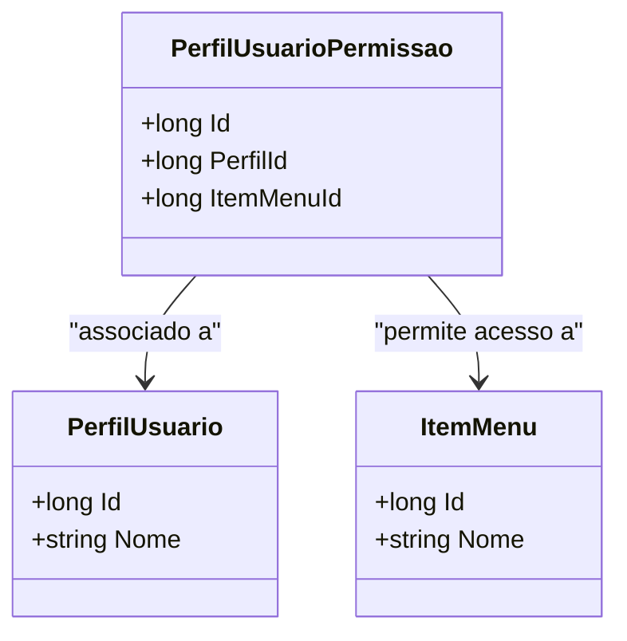

# PerfilUsuarioPermissao
**Namespace**: IsthmusWinthor.Dominio.Entidades  
**Nome do Arquivo**: PerfilUsuarioPermissao.cs  

## Visão Geral e Responsabilidade
A classe `PerfilUsuarioPermissao` atua como um modelo de domínio na camada de segurança de um sistema, representando a associação entre um perfil de usuário e as permissões de acesso a itens de menu. Essa estrutura é fundamental para garantir que usuários sejam atribuídos apenas aos itens que têm permissão para acessar, garantindo assim a integridade e segurança das operações dentro do sistema.

## Métodos de Negócio
*(Não existem métodos de negócio com lógica na classe fornecida.)*

## Propriedades Calculadas e de Validação
- **Id**: Identificador único da entidade `PerfilUsuarioPermissao`.
- **PerfilId**: Identificador do perfil de usuário associado.
- **ItemMenuId**: Identificador do item de menu relacionado à permissão.

*(Não existem propriedades com lógica no `get` ou validação no `set` na classe fornecida.)*

## Navigations Property
- [PerfilUsuario](PerfilUsuario.md): Representa o perfil associado a esta permissão.
- [ItemMenu](ItemMenu.md): Representa o item de menu ao qual a permissão se aplica.

## Tipos Auxiliares e Dependências
*(Não existem tipos auxiliares ou dependências adicionais listadas na classe fornecida.)*

## Diagrama de Relacionamentos

---
Gerada em 29/12/2025 20:42:30
