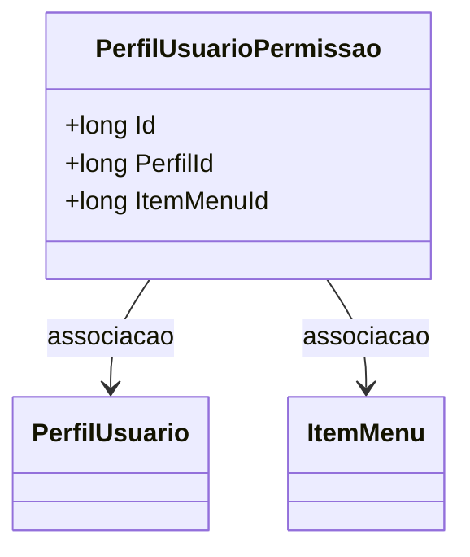

# PerfilUsuarioPermissao
**Namespace**: IsthmusWinthor.Dominio.Entidades  
**Nome do Arquivo**: PerfilUsuarioPermissao.cs  

## Visão Geral e Responsabilidade
A classe `PerfilUsuarioPermissao` atua como um modelo de domínio que representa a relação entre um usuário e as permissões associadas ao seu perfil. O propósito dessa classe é garantir que os usuários tenham acesso adequado aos itens de menu com base em seu perfil de usuário, permitindo uma gestão eficiente de permissões em sistemas corporativos que necessitam de controle de acesso.

## Métodos de Negócio
Atualmente, a classe `PerfilUsuarioPermissao` não possui métodos com lógica de negócios implementados. A operação principal da classe é a definição de relacionamentos entre as entidades, portanto, o foco está nas propriedades que representam esses vínculos.

## Propriedades Calculadas e de Validação
A classe não apresenta propriedades que possuam lógica específica no `get` ou validação no `set`. Ela serve como um modelo para a gestão de associações entre usuários e permissões.

## Navigation Properties
- `[PerfilUsuario](PerfilUsuario.md)`
- `[ItemMenu](ItemMenu.md)`

## Tipos Auxiliares e Dependências
Não existem enumeradores ou classes estáticas/helpers utilizadas diretamente nesta classe.

## Diagrama de Relacionamentos

