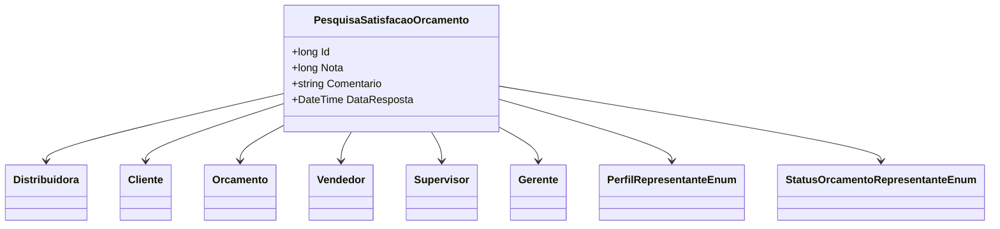

# PesquisaSatisfacaoOrcamento
**Namespace**: IsthmusWinthor.Dominio.Entidades  
**Nome do Arquivo**: PesquisaSatisfacaoOrcamento.cs  

## Visão Geral e Responsabilidade
A classe `PesquisaSatisfacaoOrcamento` representa uma entidade que coleta feedback de clientes sobre orçamentos específicos fornecidos por uma distribuidora. O principal problema de negócio que esta classe resolve é a necessidade de medir a satisfação do cliente em relação aos orçamentos recebidos, permitindo que a empresa identifique áreas de melhoria e ajuste suas estratégias de vendas.

## Métodos de Negócio
- **Título**: Não há métodos com lógica de negócio significativa definidos nesta classe.
  
## Propriedades Calculadas e de Validação
- Não há propriedades calculadas ou de validação que exijam lógica no `get` ou validação no `set` nesta classe.

## Navigations Property
- `[Distribuidora](Distribuidora.md)`
- `[Cliente](Cliente.md)`
- `[Orcamento](Orcamento.md)`
- `[Vendedor](Vendedor.md)`
- `[Supervisor](Supervisor.md)`
- `[Gerente](Gerente.md)`

## Tipos Auxiliares e Dependências
- `[PerfilRepresentanteEnum](PerfilRepresentanteEnum.md)`
- `[StatusOrcamentoRepresentanteEnum](StatusOrcamentoRepresentanteEnum.md)`

## Diagrama de Relacionamentos

