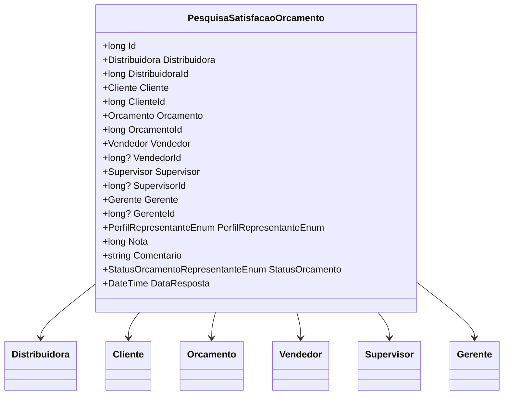

# PesquisaSatisfacaoOrcamento
**Namespace**: IsthmusWinthor.Dominio.Entidades  
**Nome do Arquivo**: PesquisaSatisfacaoOrcamento.cs

## Visão Geral e Responsabilidade
A classe `PesquisaSatisfacaoOrcamento` atua como um modelo que representa o retorno de uma pesquisa de satisfação relacionada a orçamentos. Essa entidade é responsável por capturar as impressões de um cliente sobre um orçamento específico, incluindo a nota atribuída, comentários adicionais, e informações sobre os representantes envolvidos (vendedor, supervisor, gerente). O problema de negócio que ela resolve é a necessidade de coletar feedbacks para melhorar a qualidade do serviço prestado e a satisfação do cliente.

## Métodos de Negócio
- **Título**: (não existem métodos com lógica complexa nesta classe)

## Propriedades Calculadas e de Validação
- **Nota**: A propriedade `Nota` deve estar dentro de um intervalo válido (por exemplo, de 0 a 10). A lógica de validação deve garantir que valores fora desse intervalo não sejam aceitos, promovendo integridade de dados.

## Navigations Property
- [Distribuidora](Distribuidora.md)
- [Cliente](Cliente.md)
- [Orcamento](Orcamento.md)
- [Vendedor](Vendedor.md)
- [Supervisor](Supervisor.md)
- [Gerente](Gerente.md)

## Tipos Auxiliares e Dependências
- [PerfilRepresentanteEnum](PerfilRepresentanteEnum.md)
- [StatusOrcamentoRepresentanteEnum](StatusOrcamentoRepresentanteEnum.md)

## Diagrama de Relacionamentos

---
Gerada em 29/12/2025 20:42:39
