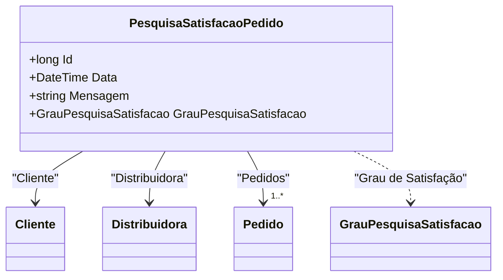

# PesquisaSatisfacaoPedido
- **Namespace**: IsthmusWinthor.Dominio.Entidades
- **Nome do Arquivo**: PesquisaSatisfacaoPedido.cs

## Visão Geral e Responsabilidade
A classe `PesquisaSatisfacaoPedido` representa uma entidade que coleta feedback dos clientes sobre sua satisfação em relação a um pedido específico. Este mecanismo é crucial para a mensuração da qualidade dos serviços prestados pela distribuidora e para a melhoria contínua dos processos. A pesquisa de satisfação permite capturar informações valiosas que podem orientar decisões empresariais e impactar a experiência do cliente.

## Métodos de Negócio
Não foram identificados métodos com lógica de negócios na classe, todos os membros são simples propriedades.

## Propriedades Calculadas e de Validação
Não foram identificadas propriedades que possuam lógica no `get` ou validação no `set`.

## Navigation Properties
- `Cliente`: Representa o cliente que realizou o pedido e está vinculado à pesquisa de satisfação. [Cliente](Cliente.md)
- `Distribuidora`: Refere-se à distribuidora associada à pesquisa de satisfação. [Distribuidora](Distribuidora.md)
- `Pedidos`: Coleção de pedidos envolvidos na pesquisa. [Pedido](Pedido.md)

## Tipos Auxiliares e Dependências
- `GrauPesquisaSatisfacao`: Enum que representa os níveis de satisfação do cliente. [GrauPesquisaSatisfacao](GrauPesquisaSatisfacao.md)

## Diagrama de Relacionamentos

