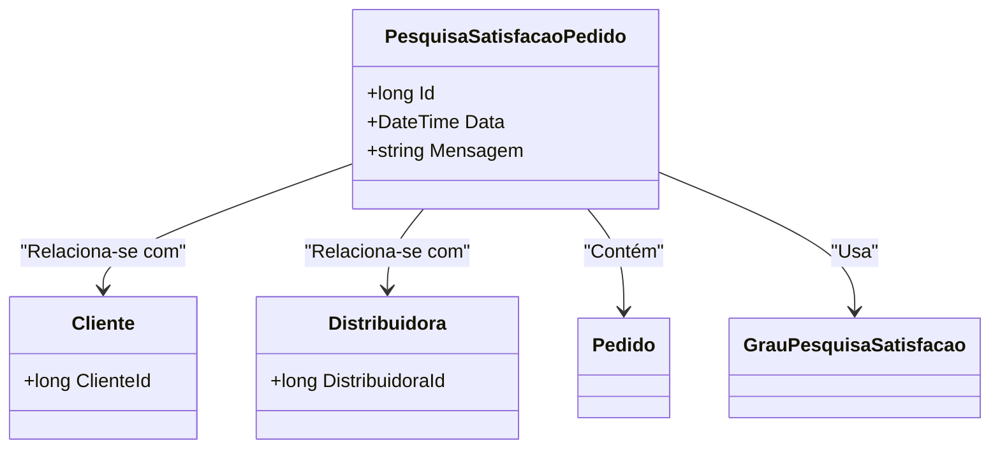

# PesquisaSatisfacaoPedido
**Namespace**: IsthmusWinthor.Dominio.Entidades  
**Nome do Arquivo**: PesquisaSatisfacaoPedido.cs  

## Visão Geral e Responsabilidade
A classe `PesquisaSatisfacaoPedido` representa uma entidade de domínio responsável pela captura e armazenamento de feedbacks de satisfação de clientes em relação a pedidos feitos. Ela conecta as informações sobre o cliente, a distribuidora e os pedidos que foram avaliados, permitindo uma análise quantitativa e qualitativa da satisfação do cliente. Isso é fundamental para o aprimoramento contínuo dos serviços prestados e para a aferição da qualidade.

## Métodos de Negócio
Esta classe não define métodos de negócio complexos que requerem descrição detalhada.

## Propriedades Calculadas e de Validação
Não existem propriedades com lógica complexa no `get` ou no `set` que precisem ser documentadas nesta classe.

## Navigation Property
- [Cliente](Cliente.md)
- [Distribuidora](Distribuidora.md)
- [Pedido](Pedido.md)
- [GrauPesquisaSatisfacao](GrauPesquisaSatisfacao.md)

## Tipos Auxiliares e Dependências
- [GrauPesquisaSatisfacao](GrauPesquisaSatisfacao.md)

## Diagrama de Relacionamentos

---
Gerada em 29/12/2025 20:42:48
