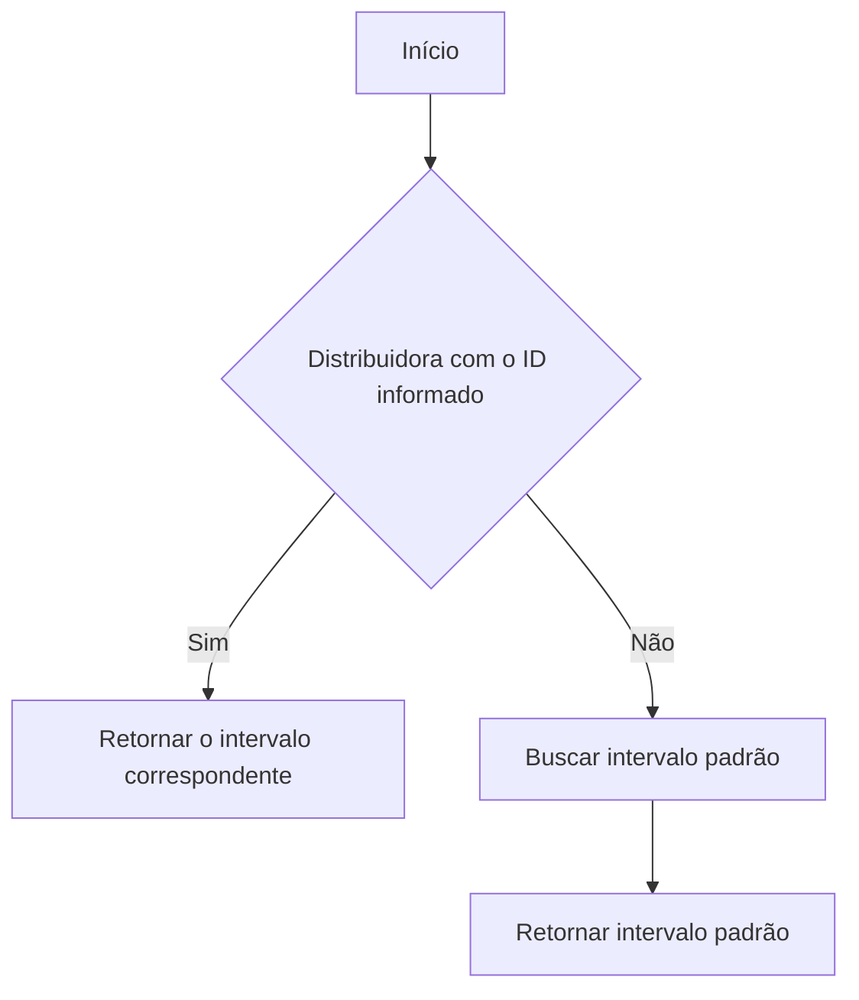
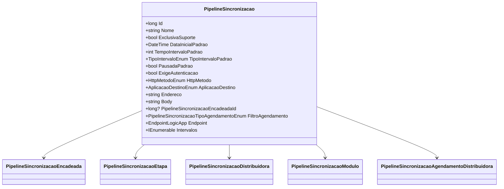

# PipelineSincronizacao
**Namespace**: IsthmusWinthor.Dominio.Entidades  
**Nome do Arquivo**: PipelineSincronizacao.cs  

## Visão Geral e Responsabilidade
A classe `PipelineSincronizacao` representa um modelo de domínio rico que gerencia o comportamento e a lógica de um pipeline de sincronização de dados. Seu papel principal é coordenar a execução de etapas de sincronização com intervalos definidos, além de manejar a autenticação, o método HTTP e a configuração de endereços. Ela serve como uma solução para integrar sistemas de forma eficiente, garantindo que os dados sejam transferidos de maneira programada e sob condições controladas.

## Métodos de Negócio

### ObterIntervaloParaDistribuidora (public)
- **Objetivo**: Garante que o intervalo correto seja recuperado para uma distribuidora específica, ou que um padrão seja utilizado caso não haja um agendamento atribuído a essa distribuidora.
- **Comportamento**:
  1. Busca dentre os intervalos disponíveis aquele que corresponde ao `DistribuidoraId` informado.
  2. Se nenhum intervalo foi encontrado, a lógica busca o intervalo padrão.
  3. Retorna o intervalo correspondente ou o padrão.
- **Retorno**: O método retorna um objeto `IntervaloLogicApp`, que representa o intervalo de tempo ajustado para a distribuidora ou o padrão caso não haja um disponível.

### DefinirTodosOsIntervalos (private)
- **Objetivo**: Cria uma lista de intervalos para o pipeline, incluindo um intervalo padrão e outros específicos de distribuidoras, se existir.
- **Comportamento**:
  1. Cria uma nova lista de objetos `IntervaloLogicApp`.
  2. Adiciona um intervalo padrão com base nas configurações do pipeline (DataInicialPadrao, TempoIntervaloPadrao, etc.).
  3. Se existirem agendamentos associados às distribuidoras, eles são convertidos em objetos `IntervaloLogicApp` e adicionados à lista.
  4. Retorna todos os intervalos definidos.
- **Retorno**: Uma coleção de `IntervaloLogicApp` que contém todos os intervalos criados.

## Propriedades Calculadas e de Validação

### FiltroAgendamento
- Garante que o tipo de agendamento retornado seja baseado nas distribuidoras e módulos exclusivos presentes.
- Regra: Se houver distribuidoras exclusivas, retorna `Distribuidora`; caso contrário, se houver módulos, retorna `Modulo`; senão, retorna `Padrao`.

### Endpoint
- Cria um novo objeto `EndpointLogicApp` com os parâmetros de autenticação, método HTTP, aplicação de destino, endereço e corpo da requisição.
- Regra: Assegura que o endpoint de chamada seja formado corretamente com base nos dados do pipeline.

### Intervalos
- Avalia e inicializa a coleção de intervalos quando necessário.
- Regra: Garante que os intervalos sejam definidos na primeira vez que são acessados, utilizando a configuração do pipeline e quaisquer agendamentos existentes.

## Navigations Property
- [PipelineSincronizacaoEncadeada](PipelineSincronizacaoEncadeada.md)
- [PipelineSincronizacaoEtapa](PipelineSincronizacaoEtapa.md)
- [PipelineSincronizacaoDistribuidora](PipelineSincronizacaoDistribuidora.md)
- [PipelineSincronizacaoModulo](PipelineSincronizacaoModulo.md)
- [PipelineSincronizacaoAgendamentoDistribuidora](PipelineSincronizacaoAgendamentoDistribuidora.md)

## Tipos Auxiliares e Dependências
- [TipoIntervaloEnum](TipoIntervaloEnum.md)
- [HttpMetodoEnum](HttpMetodoEnum.md)
- [AplicacaoDestinoEnum](AplicacaoDestinoEnum.md)
- [TipoAgendamentoEnum](TipoAgendamentoEnum.md)
- [IntervaloLogicApp](IntervaloLogicApp.md)
- [EndpointLogicApp](EndpointLogicApp.md)

## Diagrama de Relacionamentos

---
Gerada em 29/12/2025 20:43:16
