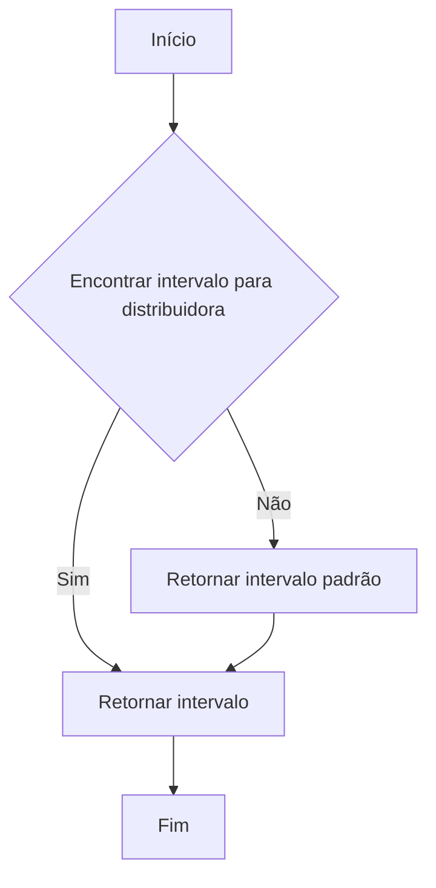
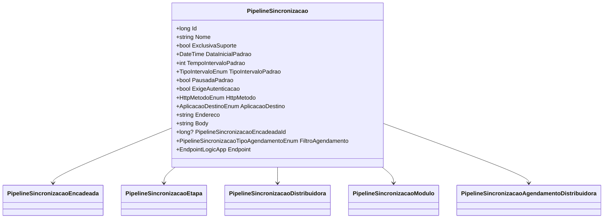

# PipelineSincronizacao
**Namespace**: IsthmusWinthor.Dominio.Entidades  
**Nome do Arquivo**: PipelineSincronizacao.cs  

## Visão Geral e Responsabilidade
A classe `PipelineSincronizacao` desempenha um papel crucial na gestão e agendamento de processos de sincronização de dados entre diferentes sistemas. Ela encapsula todas as configurações necessárias para realizar chamadas de APIs, bem como as condições que determinam a periodicidade e o estado dessas chamadas. Esse modelo é fundamental para assegurar que as integrações aconteçam de maneira organizada e eficiente, respeitando as regras de negócio definidas.

## Métodos de Negócio

### ObterIntervaloParaDistribuidora (public)
- **Objetivo**: Garantir que um intervalo de sincronização específico seja retornado para uma distribuidora. Caso não exista um intervalo específico, o padrão deve ser retornado.
- **Comportamento**:
  1. O método filtra a coleção de intervalos (`Intervalos`) para encontrar um que corresponda ao `id` da distribuidora.
  2. Se nenhum intervalo específico for encontrado, retorna o intervalo padrão que é definido com a propriedade `Padrao`.
- **Retorno**: Retorna um objeto `IntervaloLogicApp` correspondente à distribuidora ou ao intervalo padrão quando apropriado.

### DefinirTodosOsIntervalos (private)
- **Objetivo**: Gerar a lista completa de intervalos de sincronização com base nas propriedades de configuração do pipeline.
- **Comportamento**:
  1. Cria uma nova lista de `IntervaloLogicApp`.
  2. Adiciona o intervalo básico, utilizando as propriedades `DataInicialPadrao`, `TempoIntervaloPadrao`, `TipoIntervaloPadrao` e outras.
  3. Se houver agendamentos de distribuidoras, esses agendamentos são transformados em intervalos e adicionados à lista.
- **Retorno**: Retorna uma coleção de `IntervaloLogicApp` que representa todos os intervalos configurados.

## Propriedades Calculadas e de Validação
### FiltroAgendamento
- **Regra**: Esta propriedade determina o tipo de agendamento, retornando:
  - `Distribuidora`, se houver distribuidoras exclusivas.
  - `Modulo`, se houver módulos exclusivos.
  - `Padrao`, caso contrário.

### Endpoint
- **Regra**: Esta propriedade cria um `EndpointLogicApp` a partir das configurações do pipeline, unificando informações sobre autenticação, método HTTP, destino e corpo da requisição.

### Intervalos
- **Regra**: Esta propriedade garante que a lista de intervalos é inicializada apenas uma vez e retorna todos os intervalos definidos para o pipeline, incluindo aqueles baseados em agendamentos específicos de distribuidoras.

## Navigations Property
- [PipelineSincronizacaoEncadeada](PipelineSincronizacaoEncadeada.md)
- [PipelineSincronizacaoEtapa](PipelineSincronizacaoEtapa.md)
- [PipelineSincronizacaoDistribuidora](PipelineSincronizacaoDistribuidora.md)
- [PipelineSincronizacaoModulo](PipelineSincronizacaoModulo.md)
- [PipelineSincronizacaoAgendamentoDistribuidora](PipelineSincronizacaoAgendamentoDistribuidora.md)

## Tipos Auxiliares e Dependências
- [TipoIntervaloEnum](TipoIntervaloEnum.md)
- [HttpMetodoEnum](HttpMetodoEnum.md)
- [AplicacaoDestinoEnum](AplicacaoDestinoEnum.md)
- [TipoAgendamentoEnum](TipoAgendamentoEnum.md)
- [IntervaloLogicApp](IntervaloLogicApp.md)
- [EndpointLogicApp](EndpointLogicApp.md)

## Diagrama de Relacionamentos

