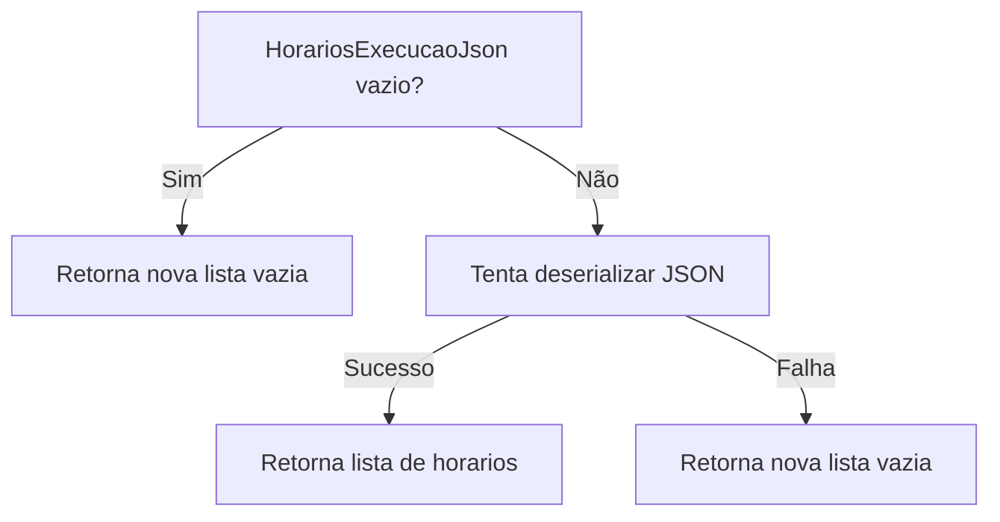
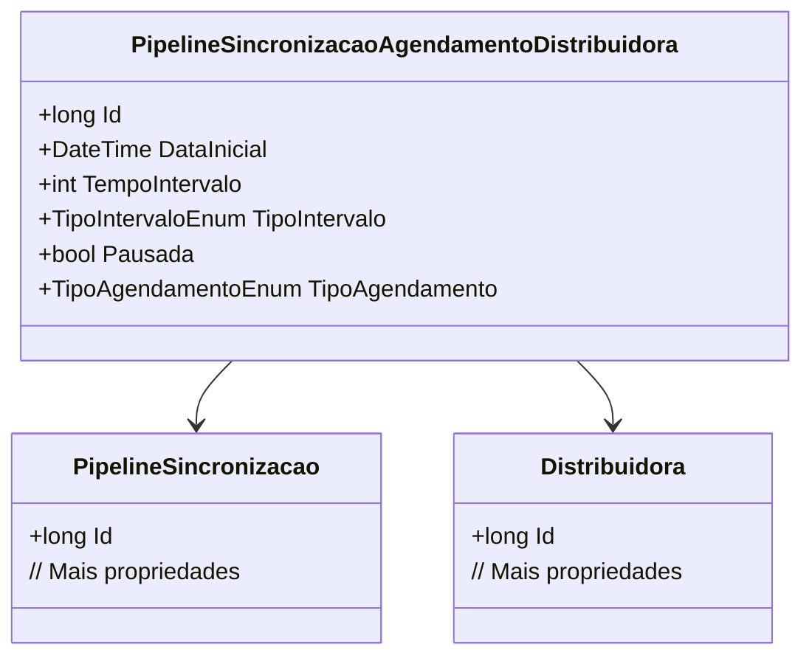

# PipelineSincronizacaoAgendamentoDistribuidora
**Namespace**: IsthmusWinthor.Dominio.Entidades  
**Nome do Arquivo**: PipelineSincronizacaoAgendamentoDistribuidora.cs  

## Visão Geral e Responsabilidade
A classe `PipelineSincronizacaoAgendamentoDistribuidora` é um modelo de domínio que representa o agendamento de sincronização para uma distribuidora específica. Seu papel é gerenciar a configuração de agendamentos que inclui a periodicidade e os horários de execução necessárias para a sincronização de dados entre diferentes sistemas. Esta classe resolve o problema de regularidade e controle eficiente nas execuções das sincronizações agendadas.

## Métodos de Negócio

### Método: `get HorariosExecucao`
- **Objetivo**: Garantir que a lista de horários de execução seja corretamente deserializada a partir de um JSON e, em caso de erro ou ausência, retorne uma lista vazia.
- **Comportamento**: 
  1. Verifica se `HorariosExecucaoJson` é nulo ou vazio.
  2. Se sim, retorna uma nova lista vazia de `TimeSpan`.
  3. Caso contrário, tenta deserializar o JSON para uma lista de `TimeSpan`.
  4. Se a deserialização falhar (capturada pela exceção), retorna uma nova lista vazia de `TimeSpan`.
- **Retorno**: Retorna uma lista de objetos `TimeSpan` que representa os horários em que as execuções estão programadas, ou uma lista vazia em caso de erro.

### Método: `set HorariosExecucao`
- **Objetivo**: Serializar a lista de horários de execução e armazená-la como um JSON.
- **Comportamento**: 
  1. Recebe uma lista de `TimeSpan`.
  2. Verifica se a lista é nula.
  3. Se sim, atribui uma nova lista vazia.
  4. Serializa a lista de `TimeSpan` em JSON e atribui ao campo `HorariosExecucaoJson`.
- **Retorno**: Não possui retorno explícito, mas altera o estado interno da classe ao armazenar os horários em formato JSON.

## Propriedades Calculadas e de Validação

### Propriedade: `HorariosExecucao`
- **Regra**: Esta propriedade é calculada com base na representação JSON dos horários de execução. Ela garante que sempre que os horários sejam acessados, eles sejam retornados de uma forma utilizável, convertendo o formato JSON armazenado para uma lista utilizável no domínio.

## Navigation Property
- [PipelineSincronizacao](PipelineSincronizacao.md) - Referência ao modelo de sincronização associado.
- [Distribuidora](Distribuidora.md) - Referência à distribuidora que está sendo sincronizada.

## Tipos Auxiliares e Dependências
- [TipoIntervaloEnum](TipoIntervaloEnum.md) - Enum que define os tipos possíveis de intervalos de tempo.
- [TipoAgendamentoEnum](TipoAgendamentoEnum.md) - Enum que define os tipos possíveis de agendamentos.

## Diagrama de Relacionamentos

---
Gerada em 29/12/2025 20:43:34
