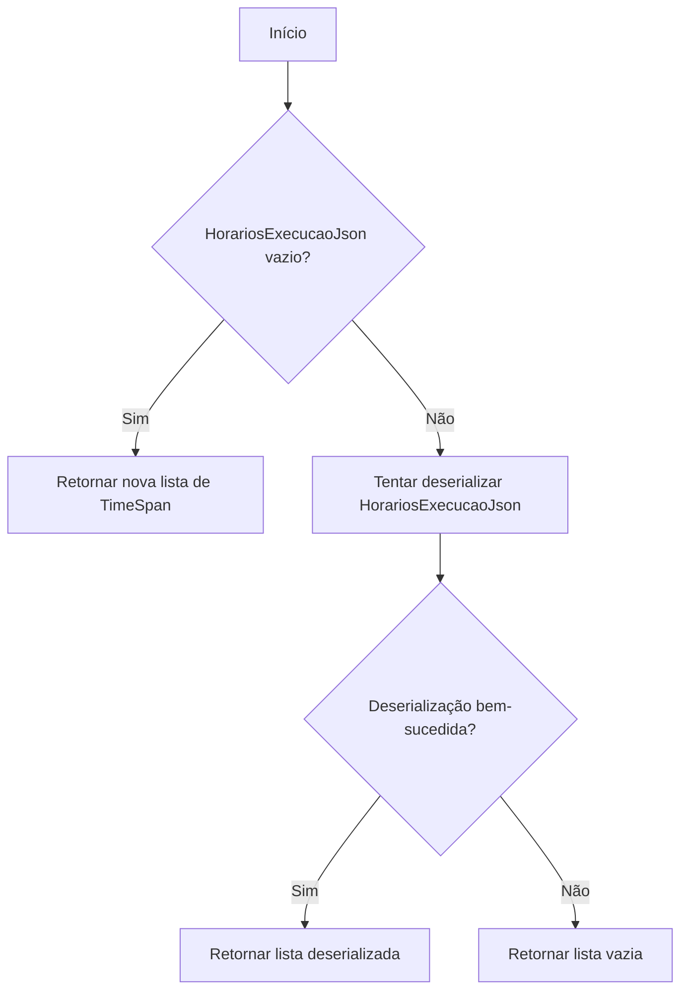
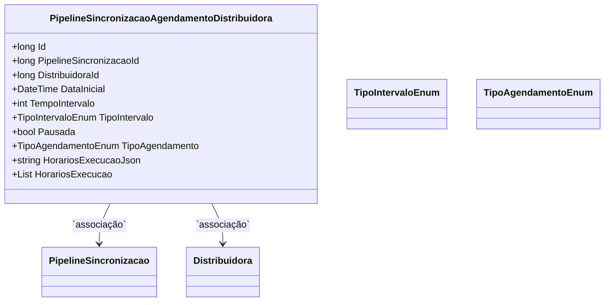

# PipelineSincronizacaoAgendamentoDistribuidora
- **Namespace**: IsthmusWinthor.Dominio.Entidades
- **Nome do Arquivo**: PipelineSincronizacaoAgendamentoDistribuidora.cs

## Visão Geral e Responsabilidade
A classe `PipelineSincronizacaoAgendamentoDistribuidora` representa um agendamento de sincronização de dados para distribuidoras em um sistema. Este modelo encapsula as regras de negócio relacionadas ao agendamento, incluindo o controle de execução, intervalo de tempo e status do agendamento. A principal função deste domínio é garantir que as sincronizações sejam realizadas de acordo com o tempo e as condições definidas, respeitando a configuração de cada distribuidora.

## Métodos de Negócio
### Método: `public List<TimeSpan> HorariosExecucao`
#### Objetivo:
Este método garante que os horários de execução sejam recuperados e armazenados adequadamente, garantindo a integridade dos dados e a correta serialização/deserialização dos horários.

#### Comportamento:
1. Verifica se a propriedade `HorariosExecucaoJson` está vazia.
   - Se estiver vazia, retorna uma nova lista de `TimeSpan`.
2. Tenta deserializar a string `HorariosExecucaoJson` em uma lista de `TimeSpan`.
   - Se a deserialização for bem-sucedida, retorna a lista.
   - Se ocorrer uma exceção durante a deserialização, retorna uma lista vazia.

#### Retorno:
Retorna uma lista de `TimeSpan` que representa os horários de execução ou uma lista vazia em caso de falhas.

### Visualização

## Propriedades Calculadas e de Validação
### Propriedade: `HorariosExecucao`
Esta propriedade possui lógica de validação e cálculo na captura de dados e na serialização das listas de horários de execução. Quando atribuída, ela serializa a lista de horários para JSON, e quando acessada, ela desserializa o JSON armazenado de volta para uma lista.

## Navigation Properties
- `PipelineSincronizacao`: `[PipelineSincronizacao](PipelineSincronizacao.md)`
- `Distribuidora`: `[Distribuidora](Distribuidora.md)`

## Tipos Auxiliares e Dependências
- Enum: `[TipoIntervaloEnum](TipoIntervaloEnum.md)`
- Enum: `[TipoAgendamentoEnum](TipoAgendamentoEnum.md)`

## Diagrama de Relacionamentos

