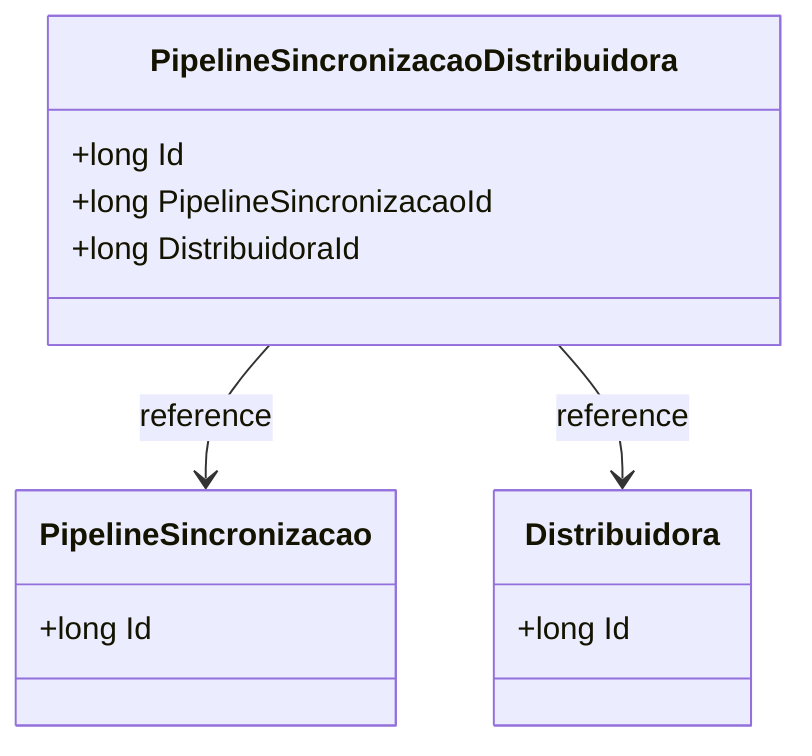

# PipelineSincronizacaoDistribuidora
- **Namespace**: IsthmusWinthor.Dominio.Entidades
- **Nome do Arquivo**: PipelineSincronizacaoDistribuidora.cs

## Visão Geral e Responsabilidade
A classe `PipelineSincronizacaoDistribuidora` representa uma entidade no contexto do sistema, associando uma distribuidora a um pipeline de sincronização. Ela garante que as distribuidoras estão corretamente ligadas ao processo de sincronização, que é crucial para a operação do sistema em ambientes onde a integração de dados é necessária. O principal problema de negócio que esta classe resolve é a necessidade de manter a integridade referencial entre distribuidoras e suas respectivas interações de sincronização.

## Navegação de Propriedades
- `PipelineSincronizacao`: [PipelineSincronizacao](PipelineSincronizacao.md) - Refere-se ao pipeline de sincronização associado.
- `Distribuidora`: [Distribuidora](Distribuidora.md) - Refere-se à distribuidora que está sendo sincronizada.

## Tipos Auxiliares e Dependências
Nenhum tipo auxiliar ou dependência específica foi identificado nesta classe.

## Diagrama de Relacionamentos

Esta documentação fornece uma visão clara sobre a estrutura e o propósito da classe `PipelineSincronizacaoDistribuidora`. A integridade da associação entre distribuidoras e pipelines de sincronização é um aspecto crítico, e este modelo ajuda a manter essa integridade no sistema.
