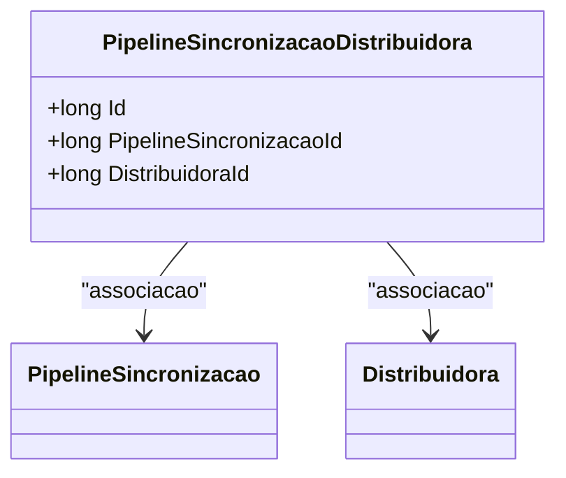

# PipelineSincronizacaoDistribuidora
**Namespace**: IsthmusWinthor.Dominio.Entidades  
**Nome do Arquivo**: PipelineSincronizacaoDistribuidora.cs  

## Visão Geral e Responsabilidade
A classe `PipelineSincronizacaoDistribuidora` atua como uma entidade que estabelece uma relação entre o `PipelineSincronizacao` e a `Distribuidora`. Ela é responsável por modelar a conexão entre essas duas entidades no contexto do sistema, facilitando a sincronização de dados entre diferentes distribuidoras e pipelines de sincronização. Este modelo é fundamental para garantir que as operações de sincronização sejam realizadas de maneira correta e eficiente.

## Métodos de Negócio
*Não existem métodos com lógica complexa nesta classe específica.*  

## Propriedades Calculadas e de Validação
*Esta classe não possui propriedades com lógica de cálculo ou validação complexa.*

## Navigation Properties
- [PipelineSincronizacao](PipelineSincronizacao.md)
- [Distribuidora](Distribuidora.md)

## Tipos Auxiliares e Dependências
*Esta classe não possui enumeradores ou helpers específicos que sejam utilizados diretamente.*

## Diagrama de Relacionamentos

---
Gerada em 29/12/2025 20:43:42
