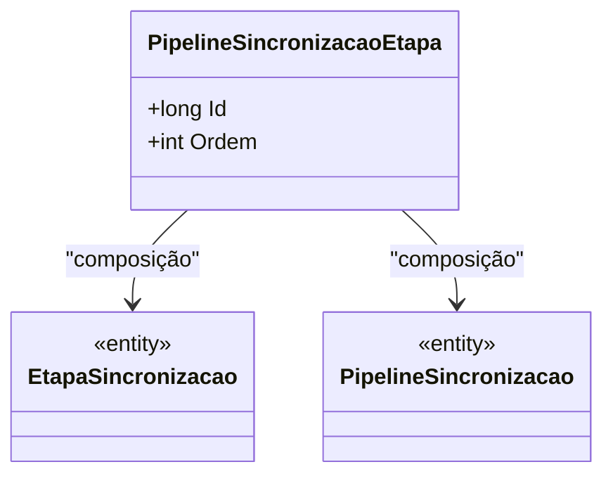

# PipelineSincronizacaoEtapa
**Namespace**: IsthmusWinthor.Dominio.Entidades  
**Nome do Arquivo**: PipelineSincronizacaoEtapa.cs  

## Visão Geral e Responsabilidade
A classe `PipelineSincronizacaoEtapa` representa uma etapa de sincronização dentro de um pipeline. Cada instância da classe é responsável por associar uma etapa de sincronização específica (`EtapaSincronizacao`) a um pipeline de sincronização (`PipelineSincronizacao`). O problema de negócio que essa classe resolve é a necessidade de gerenciar a ordem das etapas dentro de um processo de sincronização, permitindo um controle efetivo e organizado das etapas a serem executadas.

## Métodos de Negócio
**Nenhum método de negócio com lógica complexa foi identificado nesta classe.** Ela é composta majoritariamente por propriedades.

## Propriedades Calculadas e de Validação
- **Ordem**: Esta propriedade representa a ordem em que a etapa de sincronização deve ser executada dentro do pipeline. Não há lógica de validação ou cálculo no getter e setter, mas é crucial garantir que a sequência das etapas seja respeitada no contexto de execução do pipeline.

## Navigations Property
- [EtapaSincronizacao](EtapaSincronizacao.md)
- [PipelineSincronizacao](PipelineSincronizacao.md)

## Tipos Auxiliares e Dependências
Nenhum enumerador ou classe estática/helper é utilizado diretamente nesta classe.

## Diagrama de Relacionamentos

---
Gerada em 29/12/2025 20:43:49
