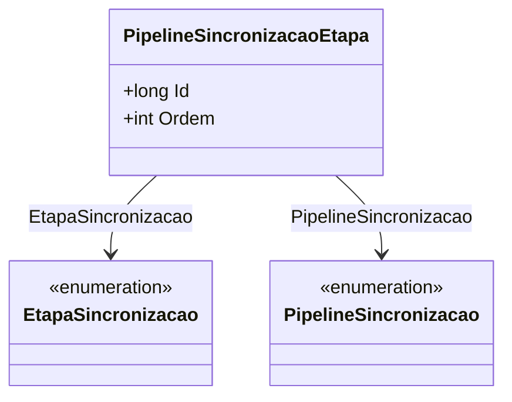

# PipelineSincronizacaoEtapa
**Namespace**: IsthmusWinthor.Dominio.Entidades  
**Nome do Arquivo**: PipelineSincronizacaoEtapa.cs  

## Visão Geral e Responsabilidade
A classe `PipelineSincronizacaoEtapa` representa uma etapa dentro do processo de sincronia de um pipeline. O papel principal desta entidade é garantir que uma sequência de etapas seja mantida para a execução correta de processos sincrônicos. Este modelo de domínio permite a definição da ordem das etapas, ligando-as a um pipeline específico, promovendo a integridade e a execução conforme as regras de negócio estabelecidas para a sincronização de dados.

## Métodos de Negócio
A classe atual não possui métodos que implementem lógica complexa, apenas contém propriedades que representam o estado da etapa de sincronia. Para essa classe, consideramos que não há métodos que precisam ser documentados.

## Propriedades Calculadas e de Validação
- As propriedades da classe não apresentam lógica complexa no `get` ou validação no `set`. Contudo, a organização da propriedade `Ordem` é essencial para garantir que as etapas sejam processadas na sequência correta, embora essa lógica não esteja implementada na classe atual.

## Navigation Property
- [`EtapaSincronizacao`](EtapaSincronizacao.md) - Representa uma referência para uma etapa específica de sincronização.
- [`PipelineSincronizacao`](PipelineSincronizacao.md) - Representa a referência para o pipeline de sincronização relacionado.

## Tipos Auxiliares e Dependências
Nenhum enumerador ou classe auxiliar é utilizado diretamente nesta classe. Contudo, links para tipos relacionados foram fornecidos nas propriedades de navegação.

## Diagrama de Relacionamentos

