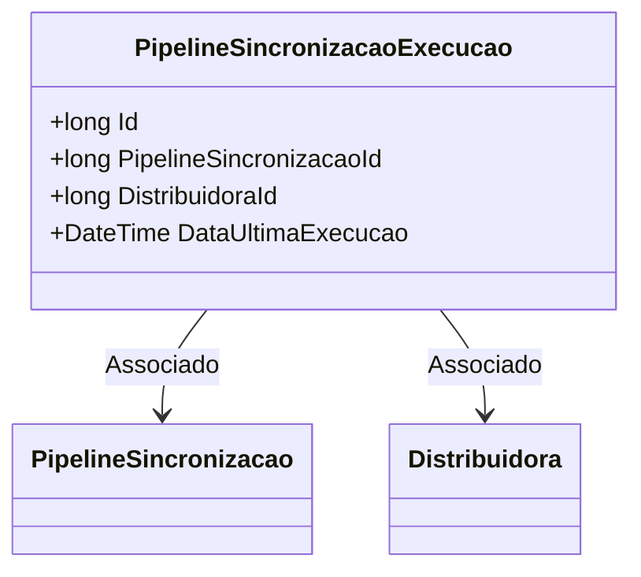

# PipelineSincronizacaoExecucao
**Namespace**: IsthmusWinthor.Dominio.Entidades  
**Nome do Arquivo**: PipelineSincronizacaoExecucao.cs  

## Visão Geral e Responsabilidade
A classe `PipelineSincronizacaoExecucao` representa uma entidade do domínio que é responsável por registrar a execução de sincronia dos pipelines. Ela armazena informações relevantes sobre cada execução, incluindo a data da última execução, o identificador do pipeline e a distribuidora associada. O objetivo principal desta classe é garantir que o sistema tenha um histórico confiável das execuções de sincronização, permitindo rastrear e auditar essas atividades.

## Métodos de Negócio
A classe não apresenta métodos com lógica complexa que se enquadrem nas diretrizes estabelecidas.

## Propriedades Calculadas e de Validação
A classe não possui propriedades que realizem cálculos ou validações em seus métodos `get` ou `set`.

## Navigations Property
A classe possui as seguintes propriedades que referenciam outras entidades do domínio:
- `[PipelineSincronizacao](PipelineSincronizacao.md)` - Representa a sincronia do pipeline associada.
- `[Distribuidora](Distribuidora.md)` - Representa a distribuidora que está vinculada a esta execução.

## Tipos Auxiliares e Dependências
A classe não utiliza enumeradores, classes estáticas ou helpers que precisem ser listadas.

## Diagrama de Relacionamentos

