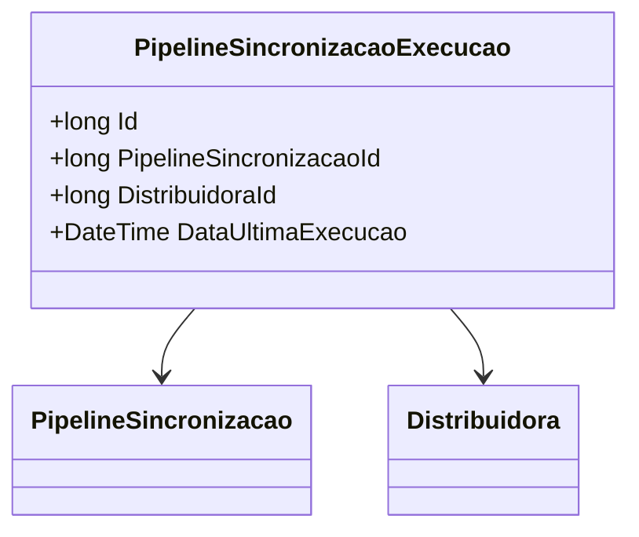

# PipelineSincronizacaoExecucao
**Namespace**: IsthmusWinthor.Dominio.Entidades  
**Nome do Arquivo**: PipelineSincronizacaoExecucao.cs  

## Visão Geral e Responsabilidade
A classe `PipelineSincronizacaoExecucao` representa a entidade que gerencia as execuções de sincronização de dados associados a um pipeline específico em um sistema de integração de dados. O problema de negócio que ela resolve está relacionado ao rastreamento das execuções realizadas, permitindo que se mantenha um histórico da última execução, essencial para auditoria e controle de processos. Isso assegura que as operações de sincronização sejam geridas de maneira eficiente e que os dados estejam sempre atualizados.

## Métodos de Negócio
*Não existem métodos de negócio com lógica complexa nesta classe. Apenas são apresentados métodos simples (getters/setters) para propriedades.*

## Propriedades Calculadas e de Validação
*Não há propriedades com lógica no `get` ou validação no `set` nesta entidade.*

## Navigations Property
- [PipelineSincronizacao](PipelineSincronizacao.md): Representa a entidade que descreve as informações sobre o pipeline de sincronização relacionados a esta execução.
- [Distribuidora](Distribuidora.md): Representa a entidade que contém informações sobre a distribuidora associada a esta execução.

## Tipos Auxiliares e Dependências
- N/A: Esta classe não possui dependências diretas a enumeradores ou classes auxiliares.

## Diagrama de Relacionamentos

---
Gerada em 29/12/2025 20:43:58
