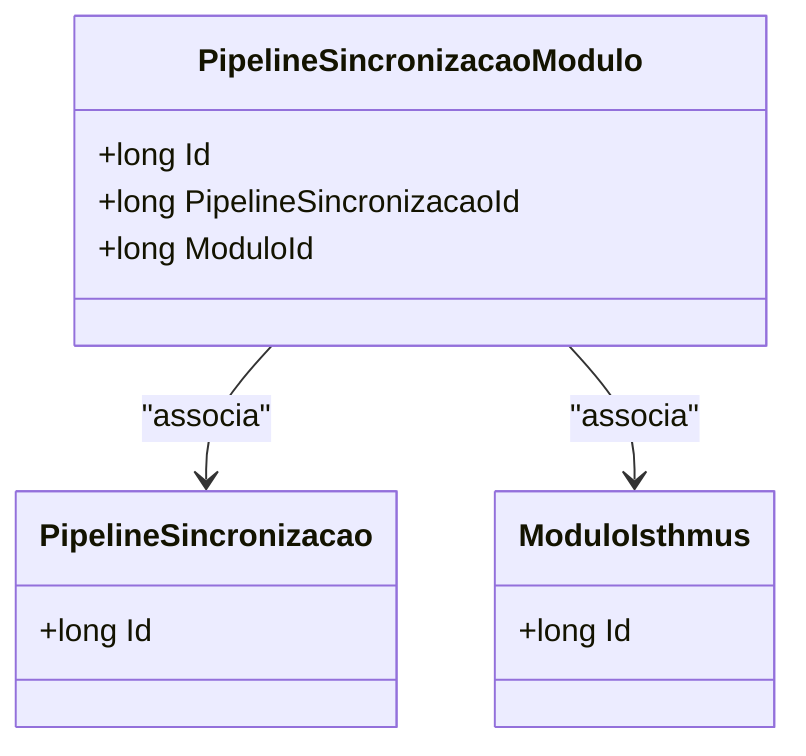

# PipelineSincronizacaoModulo
**Namespace**: IsthmusWinthor.Dominio.Entidades  
**Nome do Arquivo**: PipelineSincronizacaoModulo.cs  

## Visão Geral e Responsabilidade
A classe `PipelineSincronizacaoModulo` representa uma entidade do domínio que serve como um elo entre os módulos do Isthmus e os processos de sincronização de pipeline. Ela aborda a necessidade de associar um módulo específico a uma sincronização de pipeline, garantindo que os dados e os comportamentos relacionados à sincronização sejam corretamente vinculados aos módulos relevantes. Essa modelagem é fundamental para manter a integridade dos dados dentro do sistema.

## Métodos de Negócio
Esta classe não apresenta métodos com lógica de negócios implementada além das propriedades de associação.

## Propriedades Calculadas e de Validação
Esta classe possui apenas propriedades anêmicas sem lógica no `get` ou validações no `set`. As propriedades são simples representações de dados que estabelecem a conexão entre `PipelineSincronizacao` e `ModuloIsthmus`.

## Navigation Properties
- [PipelineSincronizacao](PipelineSincronizacao.md)
- [ModuloIsthmus](ModuloIsthmus.md)

## Tipos Auxiliares e Dependências
Nenhum tipo auxiliar ou enumerador significativo é utilizado diretamente por esta classe.

## Diagrama de Relacionamentos

Esta documentação fornece uma visão clara da classe `PipelineSincronizacaoModulo` e suas interações dentro do domínio, essencial para facilitar a manutenção e entendimento do sistema corporativo.
