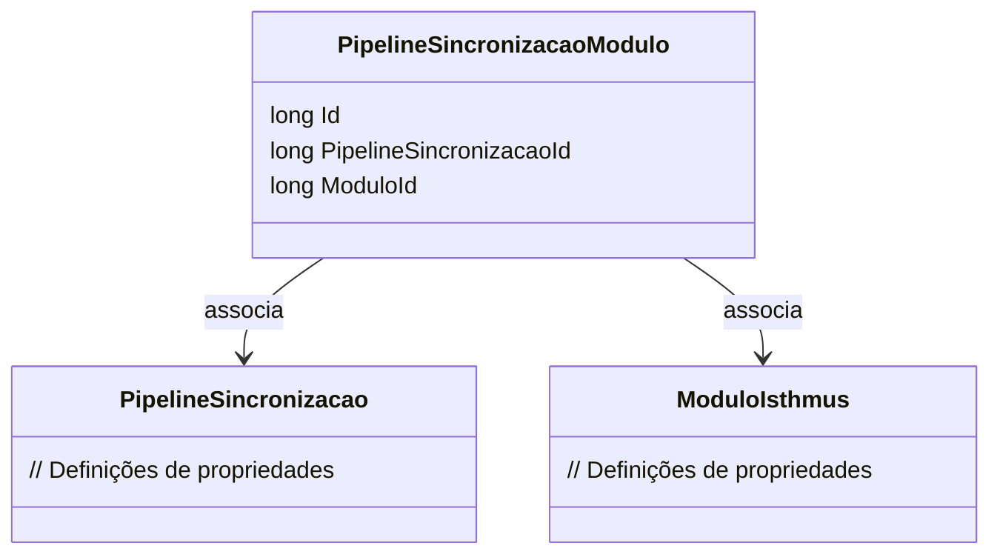

# PipelineSincronizacaoModulo
**Namespace**: IsthmusWinthor.Dominio.Entidades  
**Nome do Arquivo**: PipelineSincronizacaoModulo.cs  

## Visão Geral e Responsabilidade
A classe `PipelineSincronizacaoModulo` representa a associação entre um módulo específico do sistema e um processo de sincronização definido no pipeline. Essa entidade é crucial para a estruturação do processo de integração e sincronização de módulos, permitindo o rastreamento de quais módulos estão vinculados a cada sincronização. A classe ajuda a garantir a integridade dos dados relacionados a módulos e suas respectivas sincronizações.

## Métodos de Negócio
A classe apresentada não contém métodos de negócio com lógica interna. O foco é o armazenamento de informações e referências a outras entidades.

## Propriedades Calculadas e de Validação
A classe `PipelineSincronizacaoModulo` possui apenas propriedades anêmicas, portanto não há propriedades com lógica de cálculo ou validades que valham a pena relatar.

## Navigation Property
- [`PipelineSincronizacao`](PipelineSincronizacao.md) - Referencia o objeto de sincronização do pipeline.
- [`ModuloIsthmus`](ModuloIsthmus.md) - Referencia o módulo específico no contexto da sincronização.

## Tipos Auxiliares e Dependências
Não existem Enums ou Classes Estáticas/Helpers utilizadas diretamente nesta classe.

## Diagrama de Relacionamentos

---
Gerada em 29/12/2025 20:44:07
