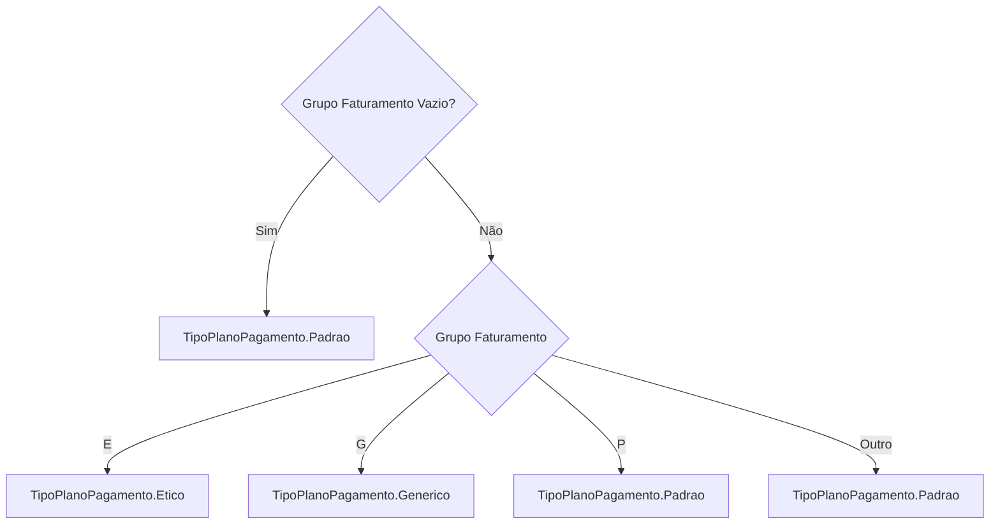
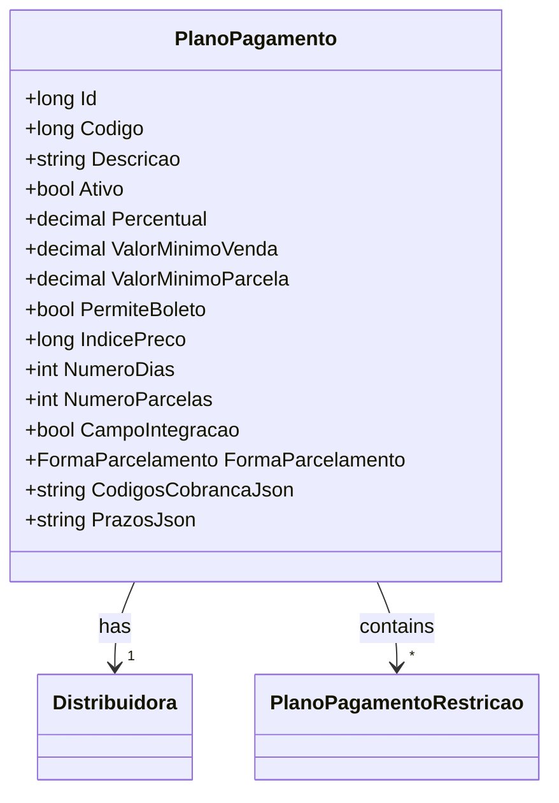

# PlanoPagamento
**Namespace**: IsthmusWinthor.Dominio.Entidades  
**Nome do Arquivo**: PlanoPagamento.cs  

## Visão Geral e Responsabilidade
A classe `PlanoPagamento` representa um modelo rico que encapsula as regras de negócio relacionadas aos planos de pagamento. Seu propósito é gerenciar informações sobre os diferentes planos de pagamento disponíveis, incluindo atributos como percentual de pagamento, valor mínimo por parcela, e a permissão para cobrança por boleto. Ela é fundamental para a integridade das operações financeiras dentro do sistema, garantindo que as regras associadas aos diferentes tipos de planos sejam aplicadas corretamente.

## Métodos de Negócio

### Método: TipoPlanoPagamentoProduto (Estático)
- **Objetivo**: Este método determina o tipo de plano de pagamento com base no grupo de faturamento do produto, garantindo a categorização correta dos planos.
- **Comportamento**: 
  1. Verifica se o grupo de faturamento é nulo ou vazio.
  2. Se for, retorna `TipoPlanoPagamento.Padrao`.
  3. Caso contrário, utiliza uma expressão switch para retornar o tipo correspondente baseado nos valores "E", "G", ou "P", ou retorna `TipoPlanoPagamento.Padrao` como valor padrão caso nenhum dos casos seja atendido.
- **Retorno**: Retorna um `TipoPlanoPagamento` que indica a categoria do plano de pagamento.

## Propriedades Calculadas e de Validação

### Propriedades com Lógica
- **CodigosCobranca**: Esta propriedade é uma lista de códigos de cobrança. O `get` tenta desserializar um JSON armazenado e retorna a lista correspondente, garantindo a integridade dos dados. O `set` converte a lista recebida de volta para JSON, removendo quaisquer entradas vazias ou nulas. A regra aqui assegura que a representação em JSON sempre esteja correta e válida.
  
- **Prazos**: Semelhante à propriedade `CodigosCobranca`, esta propriedade lida com a representação em JSON de prazos. Possui lógica de tratamento de erros tanto no `get` quanto no `set`, garantindo que a conversão sempre retorne uma lista válida.

## Navigations Property
- [Distribuidora](Distribuidora.md)
- [PlanoPagamentoRestricao](PlanoPagamentoRestricao.md)

## Tipos Auxiliares e Dependências
- **Enumeradores**: 
  - [TipoPlanoPagamento](TipoPlanoPagamento.md)
  - [FormaParcelamento](FormaParcelamento.md)

## Diagrama de Relacionamentos

---
Gerada em 29/12/2025 20:44:24
