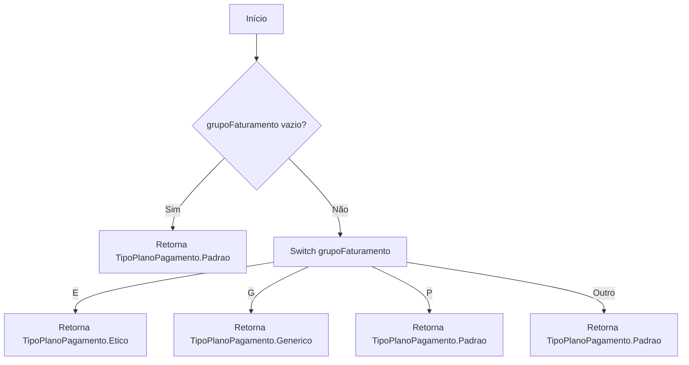
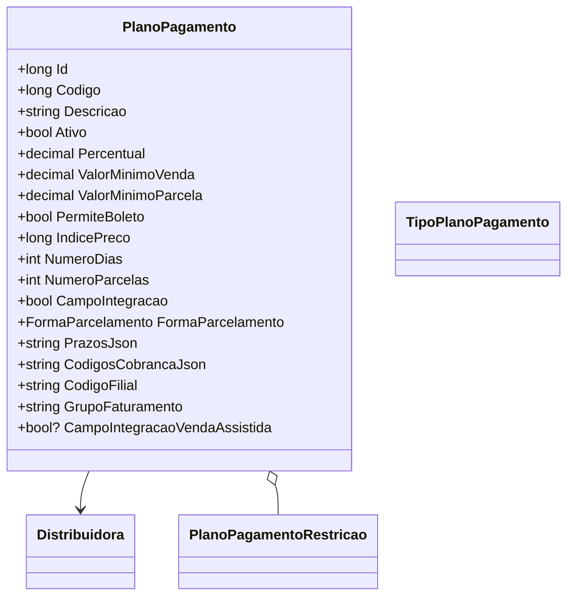

# PlanoPagamento
**Namespace**: IsthmusWinthor.Dominio.Entidades  
**Nome do Arquivo**: PlanoPagamento.cs  

## Visão Geral e Responsabilidade
A classe `PlanoPagamento` representa um modelo de domínio que gerencia as condições de pagamento para transações financeiras em um sistema de faturamento. Ela encapsula informações detalhadas sobre o plano de pagamento, como percentual, valores mínimos e formas de parcelamento, assegurando que as regras de negócio relacionadas ao processamento de pagamentos sejam respeitadas. Isso é importante para garantir que as vendas sejam realizadas de forma compatível com as expectativas de receita e estratégia financeira da empresa.

## Métodos de Negócio

### TipoPlanoPagamentoProduto
- **Título**: `TipoPlanoPagamentoProduto` (Estático)
- **Objetivo**: Este método determina o tipo do plano de pagamento com base no grupo de faturamento do produto, garantindo que as regras específicas de categorização sejam aplicadas adequadamente.
- **Comportamento**: 
    1. Verifica se o `grupoFaturamento` é nulo ou vazio.
    2. Se sim, retorna `TipoPlanoPagamento.Padrao`.
    3. Caso contrário, utiliza uma expressão `switch` para retornar o tipo baseado em diferentes grupos ("E", "G" ou "P").
- **Retorno**: Retorna um valor do tipo `TipoPlanoPagamento`, representando o tipo correspondente ao grupo de faturamento passado como argumento.

## Propriedades Calculadas e de Validação
### CodigosCobranca
- **Regra**: A propriedade `CodigosCobranca` manipula uma string JSON que representa uma lista de códigos de cobrança. Ao acessar, ela tenta desserializar a string. Se a string não estiver em formato JSON válido, a propriedade assegura a compatibilidade ao retornar a string como uma única entrada. O `set` valida que a lista não contenha entradas nulas ou em branco e atualiza a string JSON.

### Prazos
- **Regra**: A propriedade `Prazos` funciona de forma semelhante à `CodigosCobranca`, manipulando uma string JSON que representa uma lista de prazos. A lógica garante que qualquer string inválida seja tratada e que a lista retornada seja sempre válida ao acessar ou setar os valores.

## Navigation Property
- `[Distribuidora](Distribuidora.md)`
- `[PlanoPagamentoRestricao](PlanoPagamentoRestricao.md)`

## Tipos Auxiliares e Dependências
- `[TipoPlanoPagamento](TipoPlanoPagamento.md)`

## Diagrama de Relacionamentos

