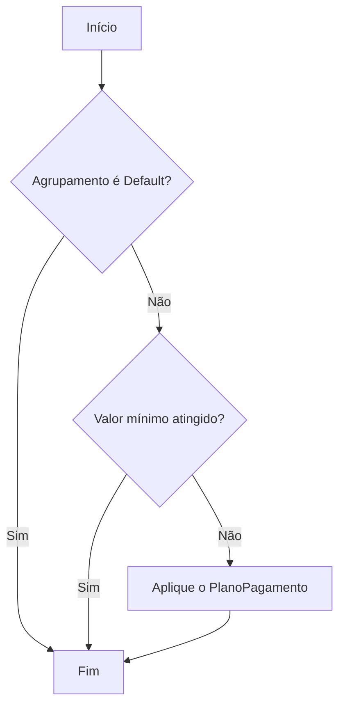
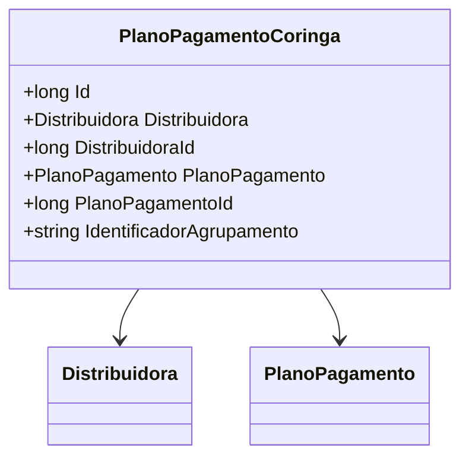

# PlanoPagamentoCoringa
**Namespace**: IsthmusWinthor.Dominio.Entidades  
**Nome do Arquivo**: PlanoPagamentoCoringa.cs  

## Visão Geral e Responsabilidade
A classe `PlanoPagamentoCoringa` é responsável por definir as regras de aplicação do plano coringa nos agrupamentos do carrinho de compras. Esta classe atua como um motor de decisão para determinar qual plano de pagamento deve ser utilizado quando o valor mínimo não é alcançado em um agrupamento específico. Ela assegura que, em casos de agrupamentos que não atendem ao critério financeiro mínimo, um plano de pagamento alternativo seja aplicado, excetuando-se o caso do agrupamento 'Default'.

## Métodos de Negócio
**Título**: AplicarPlanoCoringa  
**Objetivo**: Este método garante que, ao avaliar um agrupamento do carrinho, a regra do plano coringa será aplicada se o agrupamento não atingir o valor mínimo definido.  
**Comportamento**:
1. Verifica se o agrupamento atual é o 'Default'.
2. Caso não seja, verifica se o valor do agrupamento atinge o limite mínimo.
3. Se o limite não for atingido, aplica o `PlanoPagamento` associado ao `IdentificadorAgrupamento`.
4. Retorna o plano coringa a ser utilizado para a cobrança.

**Retorno**: Retorna um objeto `PlanoPagamento`, que é o plano a ser utilizado quando a condição de não atingir o valor mínimo é satisfeita.

## Propriedades Calculadas e de Validação
- `Distribuidora`: Necessita estar associada a uma distribuidora válida ao definir o plano coringa.
- `IdentificadorAgrupamento`: Deve ser validado para garantir que corresponde a um dos critérios especificados (Grupo de faturamento, Plano de pagamento, Rca, etc.).

## Navigations Property
- `[Distribuidora](Distribuidora.md)`
- `[PlanoPagamento](PlanoPagamento.md)`

## Tipos Auxiliares e Dependências
- `IEntidade`: Interface que a classe implementa, representando entidades do domínio.
- `PlanoPagamento`: Tipo de pagamento que pode ser aplicado.
- `Distribuidora`: Representa a classe de Distribuidora vinculada ao plano.

## Diagrama de Relacionamentos

