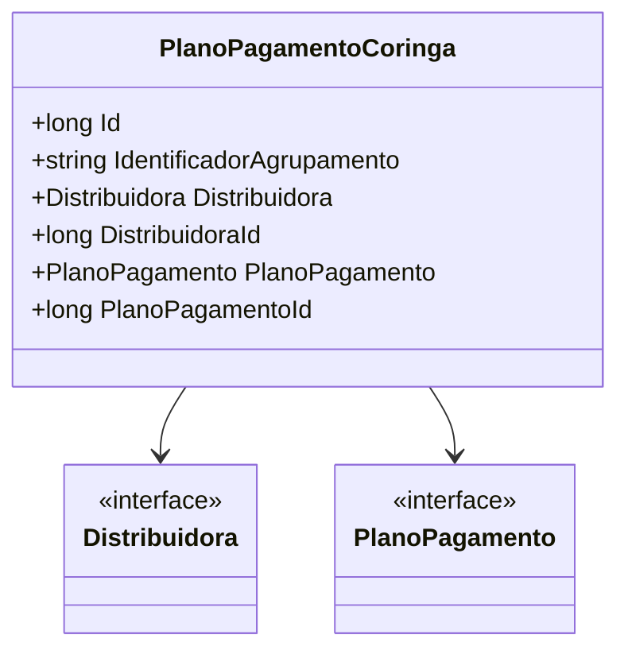

# PlanoPagamentoCoringa
- **Namespace**: IsthmusWinthor.Dominio.Entidades
- **Nome do Arquivo**: PlanoPagamentoCoringa.cs

## Visão Geral e Responsabilidade
A classe `PlanoPagamentoCoringa` representa uma regra de negócio utilizada para definição de um plano de pagamento alternativo em um agrupamento de carrinho no contexto de um sistema de e-commerce. Sua principal responsabilidade é aplicar um plano de pagamento específico quando o valor total do agrupamento não atinge o mínimo exigido. Adicionalmente, essa regra aplica-se a diferentes identificadores de agrupamento, exceto quando o agrupamento é do tipo 'Default', onde a regra não é válida.

## Métodos de Negócio
Atualmente, não existem métodos explícitos com lógica de negócio na classe `PlanoPagamentoCoringa`, uma vez que se trata de uma entidade que armazena informações de agrupamento e regras de aplicação para planos de pagamento.

## Propriedades Calculadas e de Validação
Não há propriedades que apresentem lógica de cálculo ou validação na classe `PlanoPagamentoCoringa`. Todas as propriedades se limitam a representar dados, servindo como transportadoras de informações.

## Navigations Property
- `Distribuidora`: [Distribuidora](Distribuidora.md)
- `PlanoPagamento`: [PlanoPagamento](PlanoPagamento.md)

## Tipos Auxiliares e Dependências
A classe `PlanoPagamentoCoringa` depende das seguintes classes:
- [Distribuidora](Distribuidora.md)
- [PlanoPagamento](PlanoPagamento.md)

## Diagrama de Relacionamentos

---
Gerada em 29/12/2025 20:44:31
