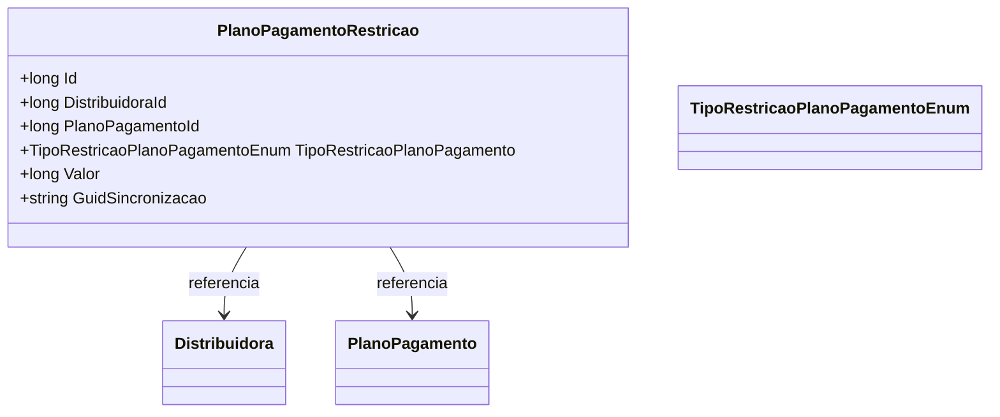

# PlanoPagamentoRestricao

**Namespace**: IsthmusWinthor.Dominio.Entidades  
**Nome do Arquivo**: PlanoPagamentoRestricao.cs  

## Visão Geral e Responsabilidade
A classe `PlanoPagamentoRestricao` representa uma entidade que modela as restrições aplicáveis a um plano de pagamento específico de uma distribuidora. O problema de negócio que esta classe resolve é o gerenciamento de condições que podem limitar ou modificar os termos de um plano de pagamento, garantindo que o sistema mantenha a integridade e as regras de negócio pertinentes às transações financeiras e acordos vigentes.

## Métodos de Negócio
Atualmente, a classe `PlanoPagamentoRestricao` não possui métodos de negócio que implementem lógica adicional além dos simples Getter e Setters.

## Propriedades Calculadas e de Validação
- Não existem propriedades calculadas com lógica ou validação complexa no `get` ou `set` nesta classe.

## Navigation Properties
- [Distribuidora](Distribuidora.md) - Representa a entidade associada que identifica a distribuidora vinculada a esta restrição.
- [PlanoPagamento](PlanoPagamento.md) - Representa o plano de pagamento associado a esta restrição.

## Tipos Auxiliares e Dependências
- [TipoRestricaoPlanoPagamentoEnum](TipoRestricaoPlanoPagamentoEnum.md) - Enumerador que categoriza os tipos de restrição aplicáveis aos planos de pagamento.

## Diagrama de Relacionamentos

---
Gerada em 29/12/2025 20:44:39
