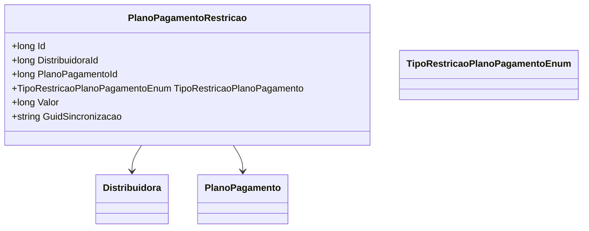

# PlanoPagamentoRestricao
**Namespace**: IsthmusWinthor.Dominio.Entidades  
**Nome do Arquivo**: PlanoPagamentoRestricao.cs  

## Visão Geral e Responsabilidade
A classe `PlanoPagamentoRestricao` representa uma entidade que vincula uma restrição a um plano de pagamento associado a uma distribuidora. Seu papel é assegurar que as regras específicas de restrição sejam aplicadas a um plano de pagamento, permitindo que as operações financeiras ocorram dentro dos limites estabelecidos pela organização. Isso ajuda a evitar transações inadequadas ou não permitidas, garantindo assim a integridade do processo de pagamento.

## Métodos de Negócio
A classe não apresenta métodos com lógica complexa, focando apenas em propriedades de dados.

## Propriedades Calculadas e de Validação
Não existem propriedades que contenham lógica de cálculo ou validação.

## Navigations Property
- `[Distribuidora](Distribuidora.md)`: Representa a distribuidora a que a restrição está associada.
- `[PlanoPagamento](PlanoPagamento.md)`: Representa o plano de pagamento ao qual esta restrição se aplica.

## Tipos Auxiliares e Dependências
- `[TipoRestricaoPlanoPagamentoEnum](TipoRestricaoPlanoPagamentoEnum.md)`: Enumerador que define os tipos de restrição aplicáveis ao plano de pagamento.

## Diagrama de Relacionamentos

