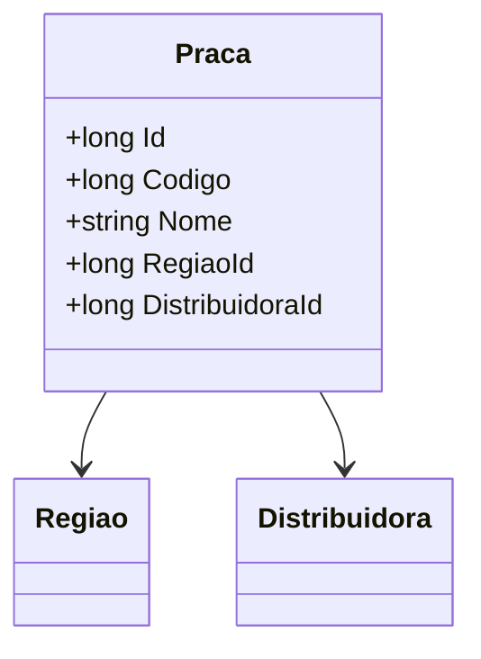

# Praca

**Namespace**: IsthmusWinthor.Dominio.Entidades  
**Nome do Arquivo**: Praca.cs  

## Visão Geral e Responsabilidade
A classe `Praca` representa uma entidade que modela uma praça de distribuição dentro do domínio de negócios da empresa. Ela encapsula informações sobre a localização, codificação e a relação com uma região e uma distribuidora associadas. Essa modelagem é crucial para garantir a integridade dos dados relacionados à distribuição e ao gerenciamento eficiente das operações logísticas.

## Métodos de Negócio
Esta classe não contém métodos de negócio com lógica, pois se trata de um modelo anêmico. Portanto, não há métodos a serem detalhados neste momento.

## Propriedades Calculadas e de Validação
Esta classe não possui propriedades que realizam cálculos no `get` ou validações no `set`. Todas as propriedades são anêmicas e simplesmente armazenam dados.

## Navigations Property
- [Regiao](Regiao.md)
- [Distribuidora](Distribuidora.md)

## Tipos Auxiliares e Dependências
Não há enumeradores ou classes estáticas/helpers utilizadas diretamente nesta classe.

## Diagrama de Relacionamentos

---
Gerada em 29/12/2025 20:44:45
