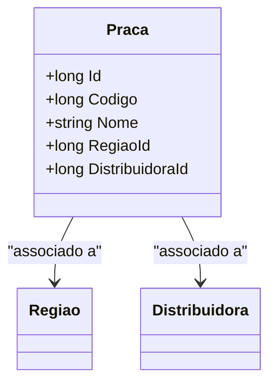

# Praca
**Namespace**: IsthmusWinthor.Dominio.Entidades  
**Nome do Arquivo**: Praca.cs  

## Visão Geral e Responsabilidade
A classe `Praca` representa uma entidade dentro do contexto da aplicação que está relacionada a uma região e uma distribuidora. Seu papel principal é modelar a relação entre esses dois componentes, permitindo a organização e gestão de espaços onde um serviço pode ser disponibilizado, como, por exemplo, zonas de distribuição de produtos. Essa classe facilita o entendimento e a gestão das regiões em que as distribuidoras operam, garantindo a integridade das associações entre as entidades.

## Métodos de Negócio
Não existem métodos com lógica de negócio complexa na classe `Praca`. 

## Propriedades Calculadas e de Validação
Não há propriedades com lógica de cálculo ou validação de entrada na classe `Praca`.

## Navigation Property
- [Regiao](Regiao.md)
- [Distribuidora](Distribuidora.md)

## Tipos Auxiliares e Dependências
Não há enumeradores ou classes auxiliares diretamente utilizadas pela classe `Praca`.

## Diagrama de Relacionamentos

