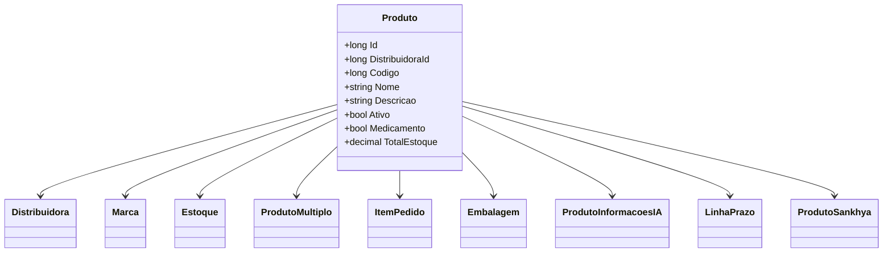

# Produto
**Namespace**: IsthmusWinthor.Dominio.Entidades  
**Nome do Arquivo**: Produto.cs  

## Visão Geral e Responsabilidade
A classe `Produto` representa um item comercial dentro do domínio do sistema, que possui diversas propriedades relacionadas tanto à sua descrição quanto à sua logística e abastecimento. Essa classe é responsável por garantir a integridade e validação dos dados relevantes ao produto, estabelecendo regras de negócio que abrangem desde a sua categorização até as informações necessárias para o controle de estoque e venda.

## Métodos de Negócio

### Título: AtendidoDepartamentoSecao (public)
**Objetivo**: Garante que um produto atende a critérios específicos de departamento e seção.  
**Comportamento**:
1. Recebe dois parâmetros: `codigoDepartamento` e `codigoSecao`.
2. Compara o `codigoDepartamento` informado com o `CodigoDepartamento` do produto. Se `codigoDepartamento` for 0, considera que atende a qualquer departamento.
3. Compara o `codigoSecao` informado com o `CodigoSecao` do produto. Se `codigoSecao` for 0, considera que atende a qualquer seção.
4. Retorna `true` se ambos os critérios forem atendidos, caso contrário, retorna `false`.  
**Retorno**: Um valor booleano que indica se o produto atende aos critérios informados.

## Propriedades Calculadas e de Validação

### Propriedades Calculadas
- **TotalEstoque**: Calcula a soma do `EstoqueDisponivel` de todas as filiais. Retorna 0 se não houver estoques disponíveis.

### Propriedades de Validação
- **EstoquesFiliais**: Serializa e desserializa informações sobre estoques em imagens de produtos. A validação é realizada em seu `set`, onde verifica se a lista de `EstoquesFiliais` é nula e realiza a conversão em JSON.

## Navigations Properties
- [Distribuidora](Distribuidora.md)
- [Marca](Marca.md)
- [Embalagem](Embalagem.md)
- [ProdutoInformacoesIA](ProdutoInformacoesIA.md)
- [ProdutoSankhya](ProdutoSankhya.md)
- [Estoque](Estoque.md)
- [ProdutoMultiplo](ProdutoMultiplo.md)
- [ItemPedido](ItemPedido.md)
- [LinhaPrazo](LinhaPrazo.md)

## Tipos Auxiliares e Dependências
- [TipoPlanoPagamento](TipoPlanoPagamento.md)
- [TipoRestricaoTransporte](TipoRestricaoTransporte.md)
- [TipoMultiploEnum](TipoMultiploEnum.md)
- [ForaLinhaFilial](ForaLinhaFilial.md)
- [EstoqueFilial](EstoqueFilial.md)

## Diagrama de Relacionamentos

---
Gerada em 29/12/2025 20:44:59
