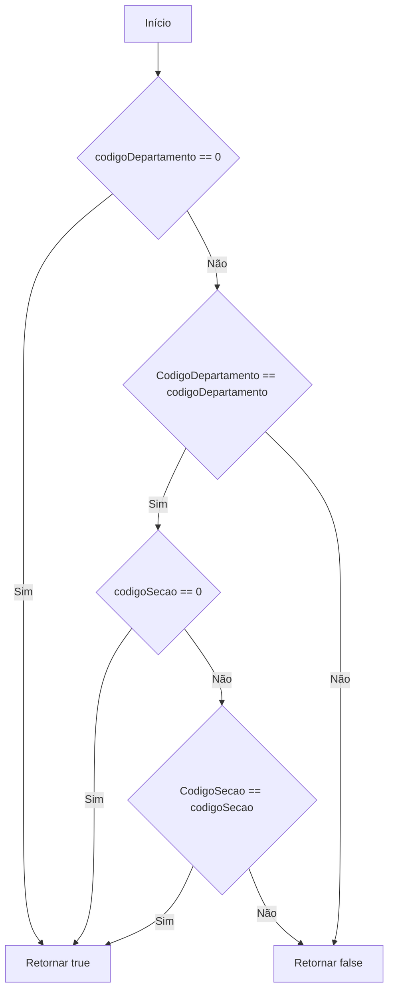
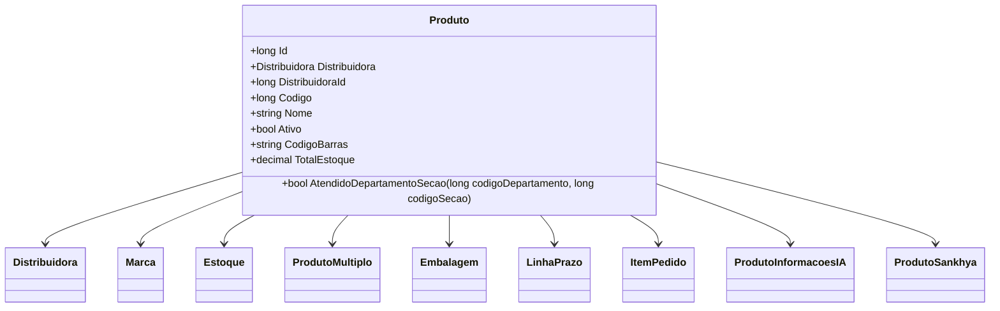

# Produto
**Namespace**: IsthmusWinthor.Dominio.Entidades  
**Nome do Arquivo**: Produto.cs  

## Visão Geral e Responsabilidade
A classe `Produto` representa uma entidade de domínio que gerencia as informações e comportamentos de um produto em um sistema de vendas. Ela é responsável por lidar com a validação de dados críticos, como quantidade mínima de compra e consistência de informações sobre estoques, e fornece a lógica necessária para garantir que as regras de negócio relacionadas à venda e gerenciamento de produtos sejam seguidas.

## Métodos de Negócio

### AtendidoDepartamentoSecao
- **Título**: `AtendidoDepartamentoSecao` (public)
- **Objetivo**: Garante que um produto pertence a um departamento e seção correta, conforme os códigos fornecidos.
- **Comportamento**: 
  1. Verifica se o `codigoDepartamento` é 0 (não aplicável).
  2. Se não for 0, verifica se o `CodigoDepartamento` do produto corresponde ao `codigoDepartamento` fornecido.
  3. Faz o mesmo para `codigoSecao`, verificando se é 0 ou se corresponde ao `CodigoSecao` do produto.
  4. Retorna verdadeiro se as condições forem válidas, ou falso caso contrário.
- **Retorno**: Retorna `true` se o produto atende às seções e departamentos informados; caso contrário, retorna `false`.

## Propriedades Calculadas e de Validação

### TotalEstoque
- **Regra**: Retorna a soma dos estoques disponíveis filtrando pelas filiais. Se não houver estoque disponível, retorna 0, garantindo assim que o valor retornado nunca seja negativo.

### EstoquesFiliais
- **Regra**: Deserializa um JSON que contém informações sobre os estoques em diferentes filiais. Se o JSON estiver vazio ou mal formado, retorna uma lista vazia, garantindo que o sistema não falhe ao acessar essas informações.

### ForaLinhaFiliais
- **Regra**: Similar a `EstoquesFiliais`, ele deserializa um JSON que contém informações sobre se um produto está "fora de linha" em filiais específicas. Se houver inconsistência nos dados, uma lista vazia será retornada sem causar erros no sistema.

## Navigations Property

- [Distribuidora](Distribuidora.md)
- [Marca](Marca.md)
- [Estoque](Estoque.md)
- [ProdutoMultiplo](ProdutoMultiplo.md)
- [Embalagem](Embalagem.md)
- [LinhaPrazo](LinhaPrazo.md)
- [ItemPedido](ItemPedido.md)
- [ProdutoInformacoesIA](ProdutoInformacoesIA.md)
- [ProdutoSankhya](ProdutoSankhya.md)

## Tipos Auxiliares e Dependências

- [TipoPlanoPagamento](TipoPlanoPagamento.md)
- [TipoRestricaoTransporte](TipoRestricaoTransporte.md)
- [TipoMultiploEnum](TipoMultiploEnum.md)

## Diagrama de Relacionamentos

