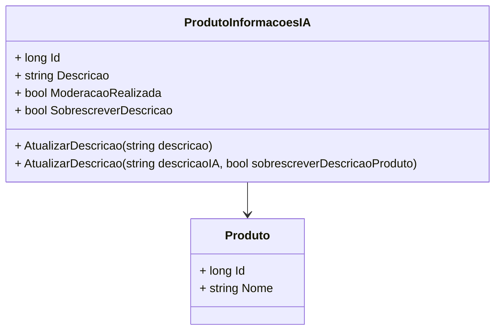

# ProdutoInformacoesIA
**Namespace**: IsthmusWinthor.Dominio.Entidades  
**Nome do Arquivo**: ProdutoInformacoesIA.cs  

## Visão Geral e Responsabilidade
A classe `ProdutoInformacoesIA` representa um modelo de domínio que encapsula informações sobre um produto, especificamente lidando com a descrição do produto gerada por inteligência artificial (IA). O principal problema de negócio que esta classe resolve é a gestão da descrição do produto, permitindo que descrições geradas por IA sejam moderadas e, se necessário, substituídas pela descrição padrão do produto. Isso garante que as informações apresentadas ao usuário sejam válidas e relevantes, mesmo quando geradas automaticamente.

## Métodos de Negócio

### Título: `AtualizarDescricao(string descricao)`
- **Objetivo**: Garante que a descrição do produto possa ser atualizada a critério do distribuidor.
- **Comportamento**: 
  1. O método atualiza a descrição do produto para o valor passado como parâmetro.
  2. A propriedade `ModeracaoRealizada` é resetada para `false` indicando que novas edições são necessárias.
  3. A propriedade `SobrescreverDescricao` também é resetada para `false`, mantendo o estado atual de não sobrescrita.
- **Retorno**: Este método não possui retorno, sendo um procedimento que altera diretamente o estado do objeto.

### Título: `AtualizarDescricao(string descricaoIA, bool sobrescreverDescricaoProduto)`
- **Objetivo**: Permite atualizar a descrição do produto com uma nova descrição gerada por IA, decidindo se deve ou não sobrescrever a descrição padrão do produto.
- **Comportamento**:
  1. O método verifica se a nova descrição gerada pela IA difere da descrição atual (ignorando diferenças de capitalização).
  2. Se a descrição foi editada, a nova descrição é salva.
  3. A propriedade `ModeracaoRealizada` é definida como `true` se qualquer uma das seguintes condições for verdadeira:
     - A descrição de IA foi editada.
     - A descrição gerada pela IA vai sobrescrever a descrição padrão do produto.
     - A moderacão já foi realizada anteriormente.
  4. A propriedade `SobrescreverDescricao` é atualizada para refletir se a descrição padrão deve ser sobrescrita.
- **Retorno**: Este método não possui retorno, ele altera o estado do objeto com base nas condições e parâmetros fornecidos.

```mermaid
flowchart TD
    A[AtualizarDescricao(descricaoIA, sobrescreverDescricaoProduto)] -->|Descricao editada| B[Atualiza Descricao]
    A -->|Descricao nao editada| C[Moderacao Realizada mantém estado]
    B --> D[Moderacao Realizada = true se descricao alterada ou sobrescrever]
    C --> D
```

## Propriedades Calculadas e de Validação
- **ModeracaoRealizada**: Verifica se a descrição foi moderada. A regra é que a moderação é considerada realizada se a descrição de IA foi editada ou se a sobrescrita da descrição padrão ocorrer.
- **SobrescreverDescricao**: Controla se a descrição gerada por IA deve substituir a descrição padrão do produto.

## Navigations Property
- `[Produto](Produto.md)`: Representa a associação do `ProdutoInformacoesIA` com a entidade `Produto`, que contém detalhes adicionais sobre o produto.

## Tipos Auxiliares e Dependências
- Nenhum enumerador ou classe estática auxiliar é utilizado nesta classe.

## Diagrama de Relacionamentos

