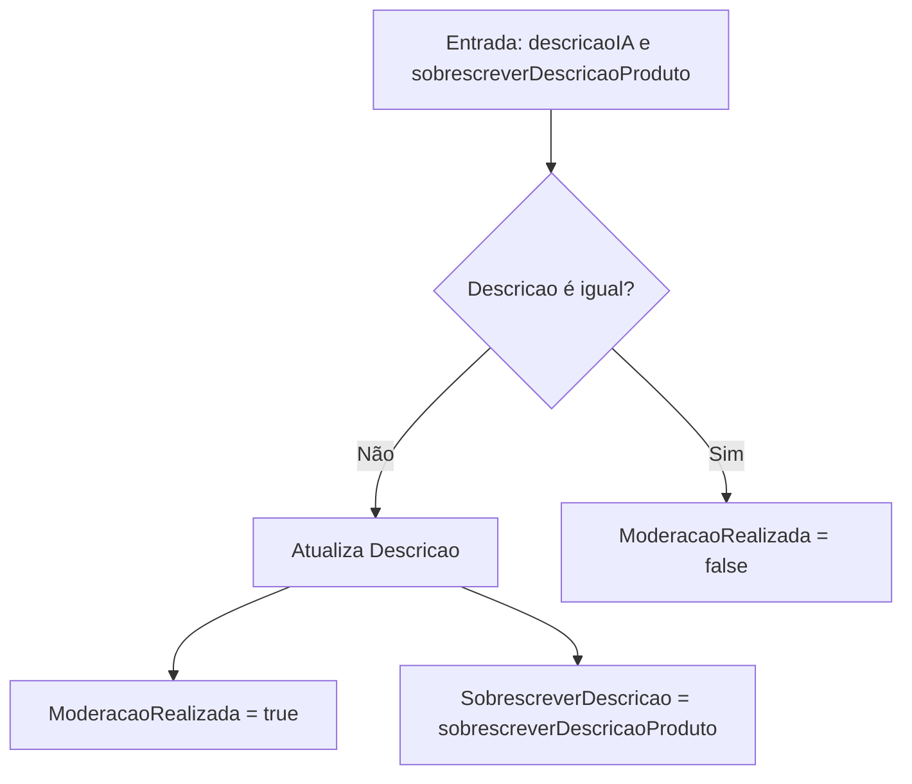
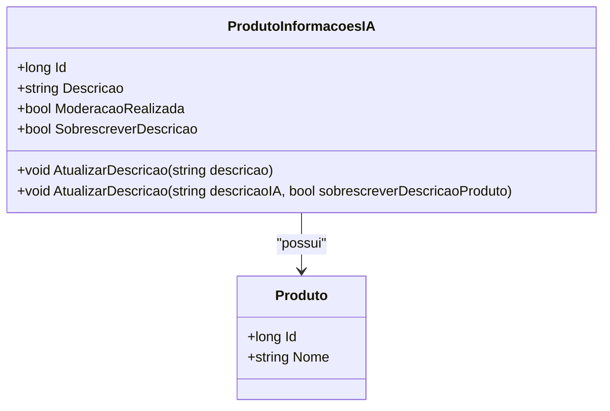

# ProdutoInformacoesIA
**Namespace**: IsthmusWinthor.Dominio.Entidades  
**Nome do Arquivo**: ProdutoInformacoesIA.cs  

## Visão Geral e Responsabilidade
A classe `ProdutoInformacoesIA` representa informações relevantes sobre um produto que podem ser geradas ou editadas por um sistema de inteligência artificial (IA). Ela é responsável por manter a descrição atualizada de um produto e lidar com a moderação das informações, garantindo que a descrição gerada pela IA seja tratada adequadamente conforme as necessidades do distribuidor. Essa classe ajuda a resolver o problema de confiança nas descrições dos produtos, permitindo uma gestão de qualidade mais rigorosa e responsiva às alterações feitas.

## Métodos de Negócio

### AtualizarDescricao(string descricao)
- **Objetivo**: Garante que a descrição do produto seja atualizada, assegurando que a moderação não tenha ocorrido.
- **Comportamento**: 
  1. A descrição do produto é alterada para o novo valor passado como parâmetro.
  2. As propriedades `ModeracaoRealizada` e `SobrescreverDescricao` são definidas como `false`, uma vez que a descrição foi editada diretamente.
- **Retorno**: Este método não retorna nenhum valor, mas altera o estado interno do objeto.

### AtualizarDescricao(string descricaoIA, bool sobrescreverDescricaoProduto)
- **Objetivo**: Este método gerencia a atualização da descrição a partir de conteúdo gerado por IA, decidindo se a descrição padrão do produto deve ser sobrescrita ou não.
- **Comportamento**: 
  1. Verifica se o conteúdo gerado pela IA (`descricaoIA`) difere da descrição atual (`Descricao`).
  2. Se for diferente, a descrição é atualizada para essa nova versão.
  3. A propriedade `ModeracaoRealizada` se torna `true` se:
     - O conteúdo da IA tiver sido editado,
     - O parâmetro `sobrescreverDescricaoProduto` for verdadeiro,
     - Ou se já houver moderação previa.
  4. A propriedade `SobrescreverDescricao` assume o valor do parâmetro `sobrescreverDescricaoProduto`.
- **Retorno**: Este método não retorna nenhum valor, mas altera o estado do objeto e reflete se a moderação foi realizada.

## Propriedades Calculadas e de Validação
Não existem propriedades com lógica de cálculo ou validação.

## Navigations Property
- `Produto`: [Produto](Produto.md)

## Tipos Auxiliares e Dependências
Nenhum enumerador ou classe estática/helper é utilizado por esta classe.

## Diagrama de Relacionamentos

---
Gerada em 29/12/2025 20:45:14
