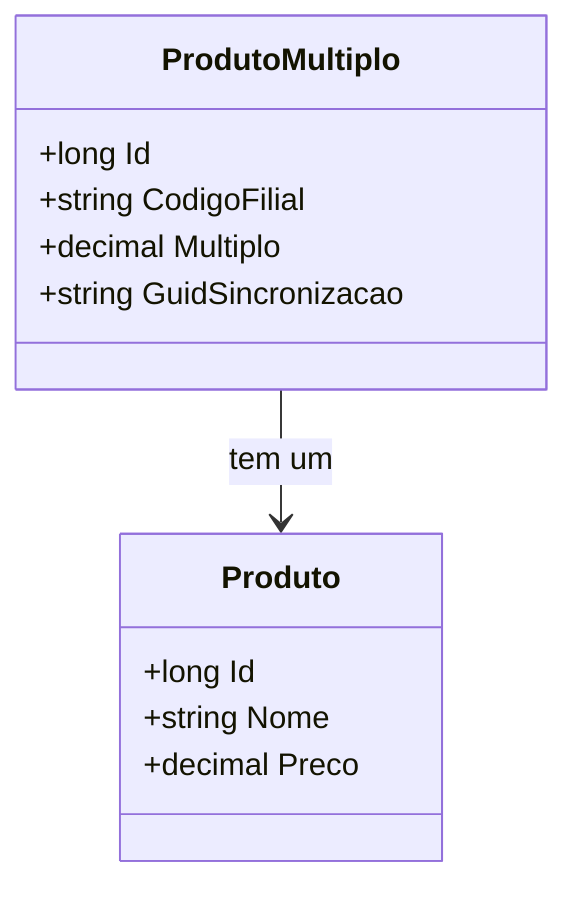

# ProdutoMultiplo
**Namespace**: IsthmusWinthor.Dominio.Entidades  
**Nome do Arquivo**: ProdutoMultiplo.cs  

## Visão Geral e Responsabilidade
A classe `ProdutoMultiplo` atua como um modelo de domínio que representa a relação entre um produto e seus múltiplos permitidos por filial. Essa abordagem permite garantir que os produtos sejam gerenciados de forma adequada, permitindo uma melhor organização e controle dos estoques e vendas, considerando as especificações de múltiplos por filial.

## Propriedades Calculadas e de Validação
Não há propriedades que contenham lógica no `get` ou validação no `set`.

## Navigation Property
- [Produto](Produto.md): Representa a ligação com a classe `Produto`, que contém detalhes do produto relacionado.

## Tipos Auxiliares e Dependências
- Nenhum enumerador ou classe auxiliar é utilizado diretamente na classe `ProdutoMultiplo`.

## Diagrama de Relacionamentos

---
Gerada em 29/12/2025 20:45:19
