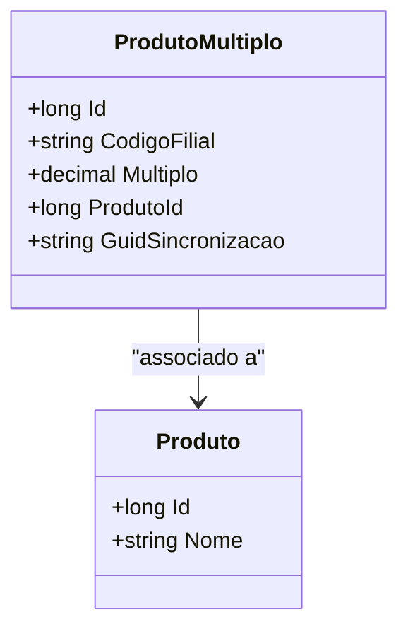

# ProdutoMultiplo
**Namespace**: IsthmusWinthor.Dominio.Entidades  
**Nome do Arquivo**: ProdutoMultiplo.cs  

## Visão Geral e Responsabilidade
A classe `ProdutoMultiplo` representa uma entidade de domínio utilizada para gerenciar produtos em unidades múltiplas dentro de uma filial específica. Esta classe resolve o problema de gestão de estoque, permitindo a definição de quantidades múltiplas para cada produto, facilitando a sincronização e o controle de inventário em diferentes filiais.

## Métodos de Negócio
Na análise realizada, a classe `ProdutoMultiplo` não contém métodos com lógica de negócio que vão além de simples getters e setters.

## Propriedades Calculadas e de Validação
A classe `ProdutoMultiplo` não apresenta propriedades com lógica de cálculo ou validações específicas a serem descritas.

## Navigations Property
- [Produto](Produto.md)

## Tipos Auxiliares e Dependências
A classe `ProdutoMultiplo` não depende de Enumeradores ou Classes Estáticas/Helpers.

## Diagrama de Relacionamentos

