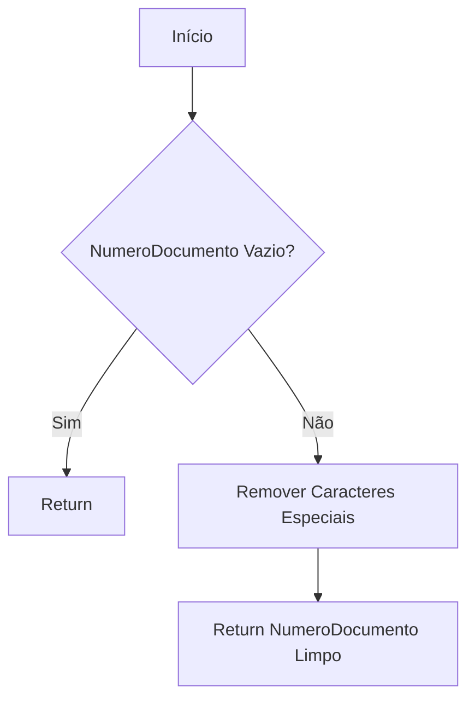
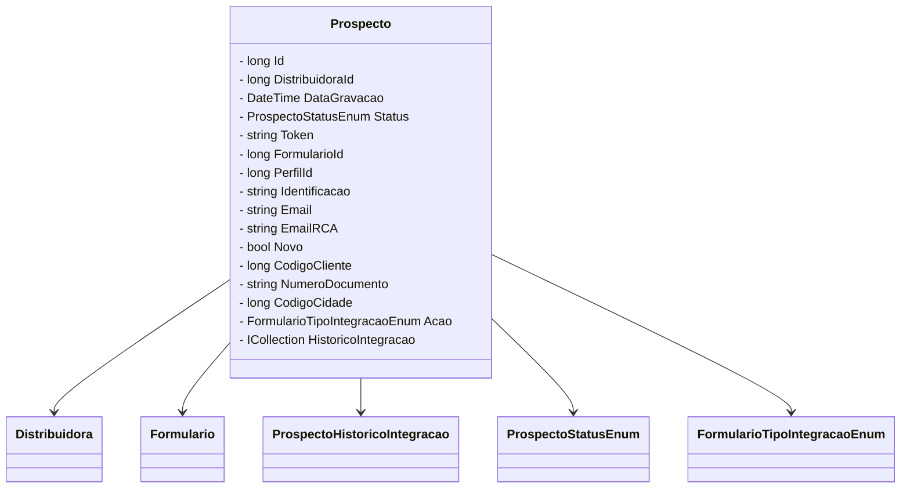

# Prospecto
**Namespace**: IsthmusWinthor.Dominio.Entidades  
**Nome do Arquivo**: Prospecto.cs  

## Visão Geral e Responsabilidade
A classe `Prospecto` representa um potencial cliente dentro do sistema, sendo um componente crucial para o gerenciamento de leads e a interação com as distribuidoras. Esta classe tem a responsabilidade de armazenar e manipular informações sobre prospects, ajudando na automação de processos e na análise de dados relacionados à captação e acompanhamento de clientes.

## Métodos de Negócio
### Título: NumeroDocumentoSemMascara (get)  
**Objetivo:** Retornar a versão limpa do número do documento, removendo todos os caracteres especiais.  
**Comportamento:**  
1. Verifica se o `NumeroDocumento` está vazio ou nulo.
2. Se estiver, retorna uma string vazia.
3. Caso contrário, utiliza um `StringBuilder` para construir uma nova string que remove slashes (`/`), hífens (`-`) e pontos (`.`) do `NumeroDocumento`.  
4. Retorna a versão limpa do número do documento.

**Retorno:** Retorna o número do documento sem formatação, útil para comparações ou armazenamento em sistemas que exigem dados limpos.

### Título: StatusDescricao (get)  
**Objetivo:** Retornar a descrição legível do status do prospecto.  
**Comportamento:**  
1. Chama o método `Description` da classe `UtilEnumDescription`, passando o `Status` atual.
2. Retorna a descrição correspondente ao valor do enum `Status`.

**Retorno:** Retorna uma string que representa a descrição do status do prospecto, proporcionando uma visualização amigável para o usuário.

## Propriedades Calculadas e de Validação
- **NumeroDocumentoSemMascara**: Propriedade que retorna o número do documento sem caracteres especiais, permitindo um tratamento mais simples e preciso em operações que não discriminam a formatação.
- **StatusDescricao**: Propriedade que converte o valor do `Status` em uma descrição mais compreensível, promovendo uma melhor experiência do usuário ao visualizar o estado atual do prospecto.

## Navigations Property
- [Distribuidora](Distribuidora.md)
- [Formulario](Formulario.md)
- [ProspectoHistoricoIntegracao](ProspectoHistoricoIntegracao.md)

## Tipos Auxiliares e Dependências
- [ProspectoStatusEnum](ProspectoStatusEnum.md)
- [FormularioTipoIntegracaoEnum](FormularioTipoIntegracaoEnum.md)
- [UtilEnumDescription](UtilEnumDescription.md)

## Diagrama de Relacionamentos

---
Gerada em 29/12/2025 20:45:37
