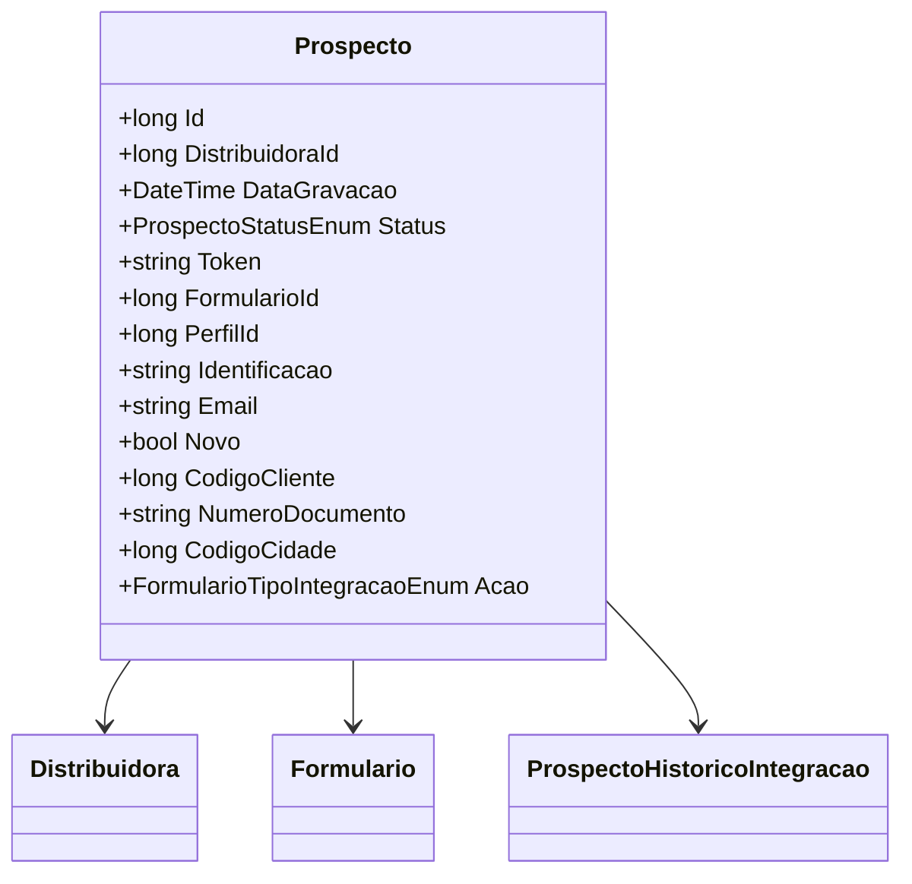

# Prospecto
- **Namespace**: IsthmusWinthor.Dominio.Entidades
- **Nome do Arquivo**: Prospecto.cs

## Visão Geral e Responsabilidade
A classe `Prospecto` representa um potencial cliente em um sistema de gestão. O principal papel dessa classe é armazenar informações relevantes sobre o prospecto, incluindo seus dados pessoais e status de interação. Ela é fundamental para a gestão de relacionamento com clientes, permitindo que a empresa acompanhe o histórico de integrações e o estado atual de cada prospecto. Além disso, a classe oferece funcionalidades para tratamento de dados e formatação, garantindo a integridade das informações relacionadas ao prospecto.

## Métodos de Negócio

### 1. Numer Documento Sem Mascara (get)
- **Objetivo**: Garante que o número do documento do prospecto seja retornado sem caracteres especiais, facilitando a manipulação e armazenamento de dados.
- **Comportamento**: 
    1. Verifica se a propriedade `NumeroDocumento` está vazia ou nula.
    2. Se estiver, retorna uma string vazia.
    3. Caso contrário, utiliza um `StringBuilder` para eliminar caracteres como "/", "-", e "." do número do documento.
    4. Retorna o número do documento formatado.
- **Retorno**: Uma string representando o número do documento sem máscara, ou uma string vazia se o número não estiver disponível.

### 2. Status Descricao (get)
- **Objetivo**: Proporciona uma descrição legível do status atual do prospecto, usando um método auxiliar para obter a descrição do enumerador.
- **Comportamento**: 
    1. Chama o método `Description` da classe `UtilEnumDescription` passando o status atual do prospecto.
    2. Retorna a descrição correspondente ao valor do enumerador `Status`.
- **Retorno**: Uma string que representa a descrição legível do status do prospecto.

## Propriedades Calculadas e de Validação

### NumeroDocumentoSemMascara
- **Regra**: A propriedade calcula um valor a partir da propriedade `NumeroDocumento`, removendo caracteres especiais. Isso assegura que os dados sejam armazenados em um formato padrão e limpo.

### StatusDescricao
- **Regra**: Esta propriedade valida o status do prospecto e gera uma descrição adequada baseada no valor do enumerador. Isso é importante para garantir que os usuários do sistema tenham uma compreensão clara do status do prospecto.

## Navegação de Propriedades
- `[Distribuidora](Distribuidora.md)`
- `[Formulario](Formulario.md)`
- `[ProspectoHistoricoIntegracao](ProspectoHistoricoIntegracao.md)`

## Tipos Auxiliares e Dependências
- `[ProspectoStatusEnum](ProspectoStatusEnum.md)`
- `[FormularioTipoIntegracaoEnum](FormularioTipoIntegracaoEnum.md)`
- `[UtilEnumDescription](UtilEnumDescription.md)`

## Diagrama de Relacionamentos

Esta documentação tem o intuito de servir como um guia técnico, esclarecendo a lógica de negócios e a integridade de dados dentro da estrutura da classe `Prospecto`.
