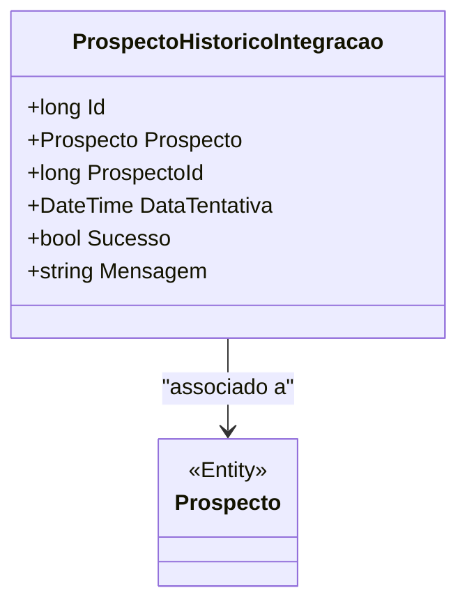

# ProspectoHistoricoIntegracao
**Namespace**: IsthmusWinthor.Dominio.Entidades  
**Nome do Arquivo**: ProspectoHistoricoIntegracao.cs  

## Visão Geral e Responsabilidade
A classe `ProspectoHistoricoIntegracao` atua como um repositório de informações sobre a integração de prospectos. Seu papel é registrar tentativas de integração com um prospecto específico, armazenando dados como a data da tentativa, se a integração foi bem-sucedida e uma mensagem resultante. Essa classe é crucial para auditoria e rastreamento de integrações, permitindo que a empresa compreenda o histórico de interações com clientes potenciais e identifique padrões de falha ou sucesso.

## Métodos de Negócio
Esta classe não contém métodos com lógica de negócio além dos simples getters e setters.

## Propriedades Calculadas e de Validação
Esta classe não possui propriedades que realizam cálculos no `get` ou validação no `set`.

## Navigations Property
- [`Prospecto`](Prospecto.md): Representa a entidade `Prospecto` associada ao histórico de integração.

## Tipos Auxiliares e Dependências
Esta classe não possui dependências evidentes a tipos auxiliares ou enums.

## Diagrama de Relacionamentos

